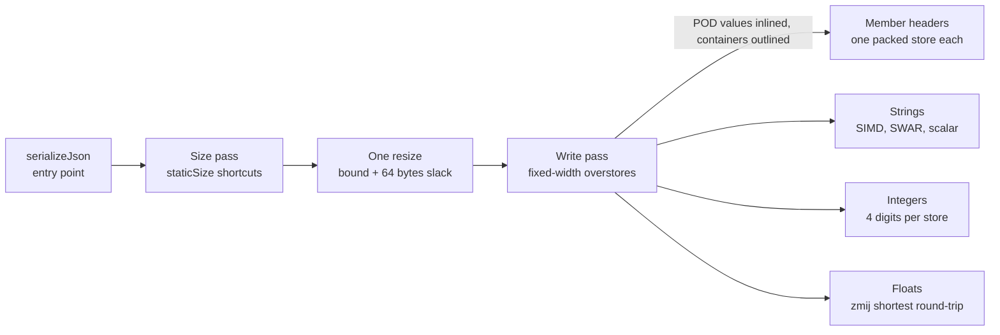

# Jsonifier Serialization: Design and Performance

**Nihilai Collective Corp — Engineering Papers**  
*Nihilai Collective Corp*  
*October 2026 — Jsonifier*  

---

## Abstract

Jsonifier serializes a reflection-registered C++ object in two passes: an exact-or-over size estimate, one buffer resize, then a single branch-light write pass that never checks capacity. Every byte the schema already knows (key names, quotes, colons, commas, indentation) is folded at compile time into packed integer constants and emitted with fixed-width stores, so the runtime work left is the data itself: strings, numbers and container lengths.

This paper describes that design as it stands in `include/jsonifier-incl/serializing/` (`serializer.hpp`, `serialize_impl.hpp`) and its helpers for strings (`string_utils.hpp`), integers (`i_to_str.hpp`) and floats (`d_to_str.hpp`).

## Architecture

The whole pipeline is resolved at compile time from `jsonifier::core<T>` and `serialize_options`: one sizing walk, one resize, one write walk.



The `serialize<options>` dispatcher forces inlining (`JSONIFIER_INLINE`) only for POD values and optionals of them (`inline_contained_v`). Objects, maps and vectors go through a plain `inline` function, so the compiler can keep large container bodies out of line instead of expanding every nested type into its caller. Each registered type gets its own `serialize_impl` specialization: objects, maps, vectors, fixed arrays, tuples, strings, chars, enums, numbers, bools, pointers and optionals, raw JSON, null, and variants (via `visit`).

## Key techniques

### Size first, then write without bounds checks

`get_size_impl` computes an upper bound for the output before a byte is written. Fixed-width types report a `staticSize` (numbers and enums 32, `bool` 5, `char` 8, null 4), so a `vector<double>` is sized as `n × 32` plus separators with no loop. Strings are sized at `6n + 2`, the worst case where every byte becomes a `\u00XX` escape. Object keys contribute `key.size() + 3` (or `+ 4` when prettified) as a compile-time constant.

`serializeJson` adds 64 bytes of slack and calls `resize_and_overwrite` when the buffer has it, so no zero-fill happens. The write pass then trusts the bound completely: no growth checks, no reallocation, and every writer may overstore (write 8 bytes, advance 4) into the slack.

### Writing through `resize_and_overwrite`

When the output buffer has C++23's `resize_and_overwrite` (detected by the `has_resize_and_overwrite` concept), the whole write pass runs inside it. `std::string::resize_and_overwrite(n, op)` grows the buffer to at least `n` without initializing it, calls `op(data, n)`, and sets the final size to whatever `op` returns. One call replaces the usual three steps: zero-filling resize, write, shrinking resize.

The `op` Jsonifier passes is `serialize_writer_ro`, a small functor that holds a reference to the object:

```cpp
template<serialize_options options, typename value_type> struct serialize_writer_ro {
	JSONIFIER_INLINE uint64_t operator()(write_buffer_ptr ptrNew, uint64_t) noexcept {
		const write_buffer_ptr bufferPtr = serialize<options>::implInline(object, ptrNew, 0);
		return static_cast<uint64_t>(bufferPtr - ptrNew);
	}
	value_type& object;
};
```

- **`operator()` is force-inlined.** `JSONIFIER_INLINE` makes the compiler expand the serializer into the standard library's call site, instead of leaving an out-of-line function that the library calls. The write pass then runs as part of `resize_and_overwrite`'s own body, with the buffer pointer in a register and no extra call frame. Whether `resize_and_overwrite` itself inlines into `serializeJson` is still the compiler's choice.
- **The functor is a reference and a function.** It holds only `value_type& object`, and its copy and move operations are deleted, so passing it costs nothing and the object is never copied.
- **The length comes straight from the pointer.** `operator()` returns the end pointer minus the start, so the final size is set from the write itself, with no second pass and no separate size variable.

Buffers without `resize_and_overwrite` take a fallback: `resize` to the bound if the buffer is smaller, write, then `resize` down to the written length. That path zero-fills on growth.

Single values skip the size pass entirely. A lone number reserves its type's maximum digit count, a lone string `6n + 2` plus one SIMD step, and a lone `bool` 8 bytes, each passed straight to the same `resize_and_overwrite` call.

### Schema text as packed integers

`packed_blitter` turns `"key":` into one constant at compile time. Literals up to 8 bytes become a single 2, 4 or 8-byte integer; longer ones become an array of `uint64_t` rounded up to 16 or a multiple of 32. Writing a member header is one `pow2MemcpyWrapper` store and a pointer bump by the true length.

### Member iteration: CABERIHT

Object members are walked with CABERIHT, Constexpr Aggregated Bases for Efficient Runtime Iteration of Heterogeneous Types. It is CAFBERIHT without the filter; the full pattern, with compile-time filtering, is described in [its own paper](https://nihilai-collective.net/cafberiht). Each member becomes a base class, and one fold expression over those bases writes the whole object in declaration order.

1. **One base per member.** `get_serialize_base` expands an index sequence over the `core<T>::parseValue` tuple and wraps each entry in `json_entity_serialize<options, entity>`. Each base carries its member's `name`, `memberPtr` and `isItLast` as compile-time constants.
2. **Aggregate the bases.** `serialize_map<bases...>` inherits from every one of them, so a type with 12 members gets one type with 12 bases.
3. **Fold over them.** `iterateValues` is a single fold, `((bufferPtr = bases::processIndex(value, bufferPtr, indent)), ...)`. Each `processIndex` is a static function of its own base, so every call is direct and resolved at compile time.

Inside each `processIndex`, nothing about the member is decided at runtime:

- the header `"name":` is that base's own `packed_blitter` constant;
- the value type is known, so `serialize<options>::impl` picks its writer with no dispatch;
- the trailing comma comes from `if constexpr (!isItLast)`, not an index check.

The sizing pass uses the same pattern: `size_getter_map` aggregates `json_entity_size` bases and folds `processIndex` over them, so both passes walk members the same way.

The result is no virtual calls, no `std::tuple` `get<I>` recursion, no runtime member index and no loop over members. A whole object becomes straight-line code: a run of fixed stores for headers and commas, with the value writers in between. The CAFBERIHT paper measures this same fold-over-bases dispatch as zero overhead against a hand-written baseline by assembly diff.

That is the distinction from CAFBERIHT. There, the bases are also filtered at compile time by tag, so only the components that match join the aggregate. Jsonifier's serializer keeps every registered member, so it has no filter step: the aggregate is exactly the members in `core<T>`. Runtime key exclusion (`jsonifierExcludedKeys`) is a separate mechanism, a set lookup inside each `processIndex` (see Limitations).

### Copies have a compile-time power-of-2 size

Nearly every copy on the write path has a power-of-2 size fixed at compile time: 2, 4 or 8 bytes. `pow2MemcpyWrapper<size>` takes the size as a template argument and `static_assert`s `std::has_single_bit(size)`, so a copy of any other size will not compile. A `memcpy` of 2, 4 or 8 bytes known at compile time lowers to a single unaligned load and store, with no call, no length branch and no tail loop.

What this does to the generated code:

| Copy | Typical x86-64 | Typical ARM64 |
| --- | --- | --- |
| Runtime length | `call memcpy` (or an inline length dispatch with branches and a tail loop) | `bl memcpy` |
| Compile-time 7 bytes | two overlapping 4-byte moves, or 4 + 2 + 1 | several loads and stores |
| Compile-time 2 / 4 / 8 bytes | one `mov` load, one `mov` store | one `ldrh`/`ldr` and one `strh`/`str` |
| Compile-time 2 / 4 / 8 bytes of constant data | one immediate store, no load (`mov qword ptr [rdi], imm`) | a constant materialized in a register, then one `str` |

- **No call.** A call to `memcpy` clobbers every caller-saved register, so live values have to be spilled and reloaded around it. Without the call, the buffer pointer and the values being written stay in registers for the whole member loop.
- **No length branches.** A runtime `memcpy` has to dispatch on the length before it copies anything. A fixed-size copy has no branch to predict or mispredict.
- **Constants become immediates.** Key headers, `true`/`false` and the empty `{}`/`[]`/`""` literals are compile-time data. Their copies can fold into immediate stores, so writing a member header needs no memory read at all.
- **Inlining and scheduling.** Each copy is one or two instructions, so a whole object's serializer inlines into straight-line code. The compiler can then interleave stores from neighbouring members with the value work between them.

That is why the writers round up and overstore instead of copying exact lengths. A 5-byte `false` is one 8-byte store. A 3-digit group is a 4-byte load followed by a 2-byte and a 1-byte store. A 7-byte key literal is one 8-byte store. The pointer then advances by the true length, and the size pass's slack absorbs the extra bytes.

Key literals longer than 8 bytes copy 16 bytes, or a multiple of 32, through the plain wrapper. That size is still a compile-time constant. The only copies whose length is known only at runtime are off the common path: escape sequences inside strings (only when an escapable byte is found), raw JSON passthrough, and the memset for indents deeper than 8 levels.

### Booleans: one subtraction, one store

A `bool` becomes JSON with no branch and no table lookup. Two 64-bit constants are built at compile time, each in the native byte order:

- `falseVInt` holds the bytes `false` packed into one word (435728179558, `0x65736C6166` on little-endian).
- `trueVInt` holds the difference between the `false` word and the `true` word (434025983730), not the `true` word itself.

The writer computes `state = falseVInt - value × trueVInt`. When `value` is 0 the result is the `false` word. When it is 1 the difference cancels and the `true` word is left. One 8-byte store writes it, and the pointer advances by `5 - value`, so `true` moves 4 bytes and `false` moves 5. The extra bytes land in the slack the size pass reserved (5 bytes per bool plus 64 at the end) and are overwritten by whatever comes next.

On the Bool test, which serializes individual bools one at a time in a loop, this writer runs at 1,178–2,318 MB/s depending on the build, 9–15× Glaze's 87–224 MB/s.

### Strings: SIMD, then SWAR, then scalar

`string_serializer` copies first and checks second. For strings of 16 bytes or more it walks the widest available SIMD width down to the narrowest, storing each block unconditionally and testing it for `"`, `\` and bytes below 0x20. A clean block advances the full width; a dirty one advances to the first escapable byte, writes its escape from a 256-entry table and resumes.

The tail of 8 to 15 bytes uses SWAR on 64-bit words (`flagMask`), with a final overlapping load of the last 8 bytes. Strings under 8 bytes use two overlapping 4-byte or 2-byte loads, so a short clean key or value costs two loads, one test and two stores.

### Integers: exact length first, then 4 digits per store

Integers go through `to_chars` in `i_to_str.hpp` in three steps.

1. **Width.** In `serialize_impl`, every integer narrower than 64 bits is widened to `uint64_t` or `int64_t`, so one writer per signedness covers all eight integer types.
2. **Sign.** A negative value writes `'-'` and then takes its absolute value without a branch: `(v ^ (v >> 63)) - (v >> 63)` on the unsigned type. Because the result is unsigned, `INT64_MIN` works too.
3. **Length.** A balanced tree of comparisons against powers of ten picks the exact digit count, 1 to 20, in at most 5 compares. Each count has its own fixed writer (`to_chars_internal<v_type, N>`), so the writer knows at compile time where every digit goes and never reverses or shifts its output.

The writers use three lookup tables built at compile time: 100 two-digit entries, 1,000 three-digit entries and 10,000 four-digit entries, each digit group pre-packed as characters. Writing four digits is one 4-byte copy from the 10,000-entry table.

Divisions are replaced by multiplies:

- **Divide by 10^4** inside an 8-digit block: multiply by 3518437209 and shift right 45.
- **Divide by 10^8** for longer values: take the high bits of a 128-bit product with 12379400392853802749 and shift right 90 in total. GCC and Clang use `__uint128_t`, MSVC uses `_umul128`, and other compilers fall back to a portable `mulhi`.

So a 20-digit `uint64_t` is two 10^8 splits, four 10^4 splits and five 4-byte stores, with no loop and no per-digit work. A 3-digit group, as at the front of a 19-digit value, is one 4-byte table load followed by a 2-byte and a 1-byte store, so nothing is written past the 3 digits.

On the Uint64 and Int64 tests, which serialize individual values one at a time in a loop, jsonifier wins on every build where they converged: 1.05–1.20× Glaze on x86 GCC and Clang, 1.27–1.28× on MSVC, 1.40–1.45× on M1 GCC, and 6.4–7.2× on M1 Clang.

### Floats

Doubles go through `zmij::detail::write`, a shortest-round-trip formatter vendored in `zmij.hpp`.

## Minified and prettified output

`serialize_options` carries `prettify`, `indentSize` (default 3) and `indentChar` (default space) as template parameters, so the two modes compile to separate code with no runtime mode check.

| Piece | Minified | Prettified |
| --- | --- | --- |
| Member header | `"key":` packed store | `"key": ` packed store |
| Separator | one `,` byte | `indent_table<",\n">` blit |
| Open / close | one `{` / `}` byte | `"{\n"` + indent, `"\n"` + indent, then `}` |
| Size estimate per member | `key + 3` | `key + 4`, plus `2 + indent` per separator |

`indent_table` prebuilds, at compile time, the prefix (`,\n`, `{\n` or `\n`) followed by 8 levels of indent characters as a packed `uint64_t` array. A newline plus indent is a short run of 8-byte stores from that table, rounded up into the slack. Nesting deeper than 8 levels falls back to `memset` for the remainder, marked `[[unlikely]]`.

This prettify path is the direct one, used when serializing an object. Prettifying existing JSON text is a separate path (`prettifier.hpp`) built on the stage-1 structural index described in *Two Stages, On Demand*.

## Performance results

Jsonifier was fastest in 111 of the 115 converged serialization tests on five builds, and lost 4. On Linux / GCC, the closest build, its full-document lead over the runner-up is 1.1–1.7× minified and about 3× prettified.

These results come from the [Json-Performance](https://github.com/nihilai-collective/Json-Performance) sweep of October 3, 2026: Jsonifier [2fb9afb](https://github.com/nihilai-collective/jsonifier/commit/2fb9afb), Glaze [52971fe](https://github.com/stephenberry/glaze/commit/52971fe), simdjson [2a690bc](https://github.com/simdjson/simdjson/commit/2a690bc), BenchmarkSuite [4e7c701](https://github.com/nihilai-collective/benchmarksuite/commit/4e7c701). The Windows / MSVC build ran Jsonifier [b7aa5cd](https://github.com/nihilai-collective/jsonifier/commit/b7aa5cd) instead of 2fb9afb. Each iteration allocates and frees its output string inside the timed region. Sampling and tie rules are listed under Method below and match those in *Two Stages, On Demand*. `simdjson (reflection)` is simdjson 5's C++26 `to_json`. It only runs on GCC, which has P2996 reflection, and only in minified tests, because its writer has no single-pass pretty mode. The Minify and Prettify tests reformat existing text instead of serializing objects, so they are left out of the counts.

### Method

**Hardware and builds.**

| Build | CPU | OS | Jsonifier | Glaze (string escape / float write) | simdjson |
| --- | --- | --- | --- | --- | --- |
| Linux / Clang 24.0 | Intel Core i9-14900KF | Linux 6.18.40.1 (WSL2) | AVX2 | AVX2 / SSE4.1 | haswell |
| Linux / GCC 16.1 | Intel Core i9-14900KF | Linux 6.18.40.1 (WSL2) | AVX2 | AVX2 / SSE4.1 | haswell |
| macOS / Clang 23.1 | Apple M1 (virtual) | macOS 25.6.0 | NEON | NEON / NEON | arm64 |
| macOS / GCC 16.2 | Apple M1 (virtual) | macOS 25.6.0 | NEON | NEON / NEON | arm64 |
| Windows / MSVC 19.44 | Intel Core i9-14900KF | Windows 10.0.26200 | AVX2 | AVX2 / SSE4.1 | haswell |

Each library picks its own instruction set at build or run time; the table lists what produced these results. Glaze reports a backend per subsystem, so its string escaper and float writer can differ within one build.

**What is timed.** Each iteration constructs a new output string, serializes into it, and destroys it, all inside the timed region, so allocation and deallocation are part of every measurement. CPU caches are cleared before iterations. All libraries serialize the same test data.

**Sampling.**

1. Iterations start at 100 and double each epoch (100, 200, 400, …) up to 100,000.
2. Each epoch runs all its iterations and evaluates a trailing window of max(iterations / 10, 30) samples, capped at 100,000.
3. Sampling never stops early: epochs continue until 5 seconds have elapsed or the iteration cap is reached.
4. Every epoch after the first is scored by its relative standard error plus its epoch-over-epoch mean shift, and the lowest-scoring epoch is kept as the result.

**Convergence.** A kept epoch counts as converged only if its RSE is under 5% and its mean shift under 2.5% on the i9 builds, or under 10% and 5% on the virtualized M1. Results that do not converge are left out of every ranking, which is why builds report different test counts.

**Ranking.** Variance is Bessel-corrected. Two libraries tie when Welch's t-test cannot separate their kept epochs. Win, tie and loss counts use only converged results.

**Caveats.** Keeping the quietest epoch favours each library's least-disturbed stretch, which raises absolute throughput somewhat, but the rule applies identically to every library. The i9 numbers were taken under WSL2 and the M1 numbers in a virtual machine, so absolute MB/s may differ from bare metal; within a build, every library ran in the same environment.

| Platform / compiler | Write tests converged | Jsonifier fastest | Jsonifier lost |
| --- | --- | --- | --- |
| Linux / Clang 24.0 (i9-14900KF, AVX2) | 22 | 22 | 0 |
| Linux / GCC 16.1 (i9-14900KF, AVX2) | 23 | 22 | 1 |
| macOS / Clang 23.1 (Apple M1, NEON) | 25 | 24 | 1 |
| macOS / GCC 16.2 (Apple M1, NEON) | 20 | 19 | 1 |
| Windows / MSVC 19.44 (i9-14900KF, AVX2) | 25 | 24 | 1 |
| **Total** | **115** | **111** | **4** |

Every converged write test per build follows, in MB/s. Bool, Double, Int64, String and Uint64 serialize individual values one at a time in a loop. The rest serialize whole documents. *Lead* is Jsonifier's throughput divided by the fastest other library's, so a value under 1 is a loss.

### Linux / Clang 24.0 (i9-14900KF, AVX2)

| Test | Jsonifier | Glaze | Lead |
| --- | --- | --- | --- |
| Bool | 2,318 | 224 | 10.35× |
| Double | 333 | 312 | 1.07× |
| Int64 | 1,018 | 951 | 1.07× |
| String | 3,634 | 2,087 | 1.74× |
| Uint64 | 986 | 934 | 1.06× |
| Canada (minified) | 1,450 | 942 | 1.54× |
| Canada (prettified) | 5,097 | 3,084 | 1.65× |
| CitmCatalog (minified) | 9,816 | 5,553 | 1.77× |
| CitmCatalog (prettified) | 19,176 | 5,547 | 3.46× |
| Discord (minified) | 11,584 | 6,013 | 1.93× |
| Discord (prettified) | 15,541 | 4,795 | 3.24× |
| Google Maps (minified) | 8,263 | 3,879 | 2.13× |
| Google Maps (prettified) | 16,131 | 4,933 | 3.27× |
| Instruments (minified) | 16,611 | 6,497 | 2.56× |
| Instruments (prettified) | 20,907 | 5,377 | 3.89× |
| Marine IK Reverse (minified) | 792 | 610 | 1.30× |
| Marine IK Reverse (prettified) | 5,617 | 3,405 | 1.65× |
| Mesh (minified) | 1,468 | 1,013 | 1.45× |
| Mesh (prettified) | 2,777 | 1,695 | 1.64× |
| Random (prettified) | 11,187 | 3,806 | 2.94× |
| Twitter (minified) | 12,182 | 6,065 | 2.01× |
| Twitter (prettified) | 16,655 | 4,003 | 4.16× |

### Linux / GCC 16.1 (i9-14900KF, AVX2)

| Test | Jsonifier | simdjson (reflection) | Glaze | Lead |
| --- | --- | --- | --- | --- |
| Bool | 1,919 | 335 | 221 | 5.73× |
| Double | 344 | 399 | 296 | 0.86× |
| String | 3,481 | 1,602 | 2,204 | 1.58× |
| Uint64 | 968 | 620 | 806 | 1.20× |
| Canada (minified) | 1,881 | 920 | 1,398 | 1.35× |
| Canada (prettified) | 5,484 | — | 3,054 | 1.80× |
| CitmCatalog (minified) | 9,949 | 6,544 | 5,395 | 1.52× |
| CitmCatalog (prettified) | 17,335 | — | 6,109 | 2.84× |
| Discord (minified) | 10,270 | 8,882 | 6,236 | 1.16× |
| Discord (prettified) | 14,841 | — | 6,219 | 2.39× |
| Google Maps (minified) | 7,742 | 6,252 | 3,595 | 1.24× |
| Google Maps (prettified) | 15,563 | — | 6,020 | 2.59× |
| Instruments (minified) | 13,949 | 8,447 | 5,470 | 1.65× |
| Instruments (prettified) | 18,801 | — | 5,675 | 3.31× |
| Marine IK Reverse (minified) | 1,198 | 682 | 955 | 1.25× |
| Marine IK Reverse (prettified) | 5,699 | — | 3,385 | 1.68× |
| Marine IK (minified) | 1,180 | 695 | 936 | 1.26× |
| Mesh (minified) | 2,177 | 1,068 | 1,484 | 1.47× |
| Mesh (prettified) | 4,141 | — | 2,530 | 1.64× |
| Random (minified) | 6,400 | 5,746 | 3,601 | 1.11× |
| Random (prettified) | 11,147 | — | 4,341 | 2.57× |
| Twitter (minified) | 10,466 | 7,562 | 6,306 | 1.38× |
| Twitter (prettified) | 15,316 | — | 5,074 | 3.02× |

### macOS / Clang 23.1 (Apple M1, NEON)

| Test | Jsonifier | Glaze | Lead |
| --- | --- | --- | --- |
| Bool | 1,759 | 117 | 15.03× |
| Double | 257 | 170 | 1.51× |
| Int64 | 3,439 | 478 | 7.19× |
| String | 962 | 1,047 | 0.92× |
| Uint64 | 2,899 | 452 | 6.41× |
| Canada (minified) | 2,195 | 1,464 | 1.50× |
| Canada (prettified) | 5,512 | 2,569 | 2.15× |
| CitmCatalog (minified) | 6,200 | 1,733 | 3.58× |
| CitmCatalog (prettified) | 14,482 | 2,672 | 5.42× |
| Discord (minified) | 7,243 | 2,505 | 2.89× |
| Discord (prettified) | 10,575 | 2,494 | 4.24× |
| Google Maps (minified) | 5,646 | 1,361 | 4.15× |
| Google Maps (prettified) | 11,817 | 2,521 | 4.69× |
| Instruments (minified) | 10,509 | 1,692 | 6.21× |
| Instruments (prettified) | 18,321 | 1,982 | 9.24× |
| Marine IK Reverse (minified) | 1,158 | 748 | 1.55× |
| Marine IK Reverse (prettified) | 5,643 | 2,720 | 2.07× |
| Marine IK (minified) | 1,291 | 691 | 1.87× |
| Marine IK (prettified) | 5,345 | 2,441 | 2.19× |
| Mesh (minified) | 2,399 | 1,025 | 2.34× |
| Mesh (prettified) | 4,429 | 1,661 | 2.67× |
| Random (minified) | 4,290 | 1,769 | 2.43× |
| Random (prettified) | 6,411 | 2,183 | 2.94× |
| Twitter (minified) | 9,028 | 2,561 | 3.53× |
| Twitter (prettified) | 11,338 | 2,867 | 3.95× |

### macOS / GCC 16.2 (Apple M1, NEON)

| Test | Jsonifier | simdjson (reflection) | Glaze | Lead |
| --- | --- | --- | --- | --- |
| Bool | 1,548 | 102 | 114 | 13.58× |
| Double | 246 | 136 | 161 | 1.53× |
| Int64 | 672 | 267 | 465 | 1.45× |
| String | 863 | 549 | 1,071 | 0.81× |
| Uint64 | 677 | 277 | 485 | 1.40× |
| Canada (minified) | 2,081 | 640 | 1,111 | 1.87× |
| CitmCatalog (minified) | 6,774 | 4,134 | 1,607 | 1.64× |
| Discord (prettified) | 7,114 | — | 1,998 | 3.56× |
| Google Maps (minified) | 5,955 | 3,811 | 1,438 | 1.56× |
| Google Maps (prettified) | 9,398 | — | 2,577 | 3.65× |
| Instruments (minified) | 9,911 | 3,723 | 1,452 | 2.66× |
| Instruments (prettified) | 10,307 | — | 1,940 | 5.31× |
| Marine IK Reverse (minified) | 905 | 482 | 681 | 1.33× |
| Marine IK (prettified) | 4,307 | — | 2,155 | 2.00× |
| Mesh (minified) | 2,009 | 710 | 791 | 2.54× |
| Mesh (prettified) | 3,504 | — | 1,360 | 2.58× |
| Random (minified) | 5,543 | 4,726 | 1,763 | 1.17× |
| Random (prettified) | 7,132 | — | 2,259 | 3.16× |
| Twitter (minified) | 9,677 | 5,364 | 3,247 | 1.80× |
| Twitter (prettified) | 10,141 | — | 3,368 | 3.01× |

### Windows / MSVC 19.44 (i9-14900KF, AVX2)

| Test | Jsonifier | Glaze | Lead |
| --- | --- | --- | --- |
| Bool | 1,178 | 87 | 13.58× |
| Double | 202 | 136 | 1.48× |
| Int64 | 484 | 381 | 1.27× |
| String | 1,162 | 862 | 1.35× |
| Uint64 | 478 | 372 | 1.28× |
| Canada (minified) | 1,197 | 811 | 1.48× |
| Canada (prettified) | 2,718 | 1,511 | 1.80× |
| CitmCatalog (minified) | 9,624 | 4,471 | 2.15× |
| CitmCatalog (prettified) | 4,429 | 1,887 | 2.35× |
| Discord (minified) | 8,111 | 4,368 | 1.86× |
| Discord (prettified) | 12,308 | 4,218 | 2.92× |
| Google Maps (minified) | 6,432 | 3,406 | 1.89× |
| Google Maps (prettified) | 13,017 | 5,542 | 2.35× |
| Instruments (minified) | 12,072 | 4,262 | 2.83× |
| Instruments (prettified) | 17,104 | 4,553 | 3.76× |
| Marine IK Reverse (minified) | 797 | 691 | 1.15× |
| Marine IK Reverse (prettified) | 2,704 | 1,795 | 1.51× |
| Marine IK (minified) | 778 | 596 | 1.31× |
| Marine IK (prettified) | 2,637 | 1,227 | 2.15× |
| Mesh (minified) | 1,264 | 919 | 1.38× |
| Mesh (prettified) | 2,092 | 1,479 | 1.41× |
| Random (minified) | 2,822 | 2,876 | 0.98× |
| Random (prettified) | 3,887 | 2,200 | 1.77× |
| Twitter (minified) | 9,168 | 4,156 | 2.21× |
| Twitter (prettified) | 12,062 | 3,685 | 3.27× |

The prettified lead comes from the indent tables: a newline plus indent is a few 8-byte stores, not a loop. Three of the four losses are on the POD tests, which serialize individual values one at a time in a loop; the fourth is one full document on MSVC:

- **String test, M1, both compilers.** Glaze runs 1,071 vs 863 MB/s on GCC (Jsonifier at 0.81×) and 1,047 vs 962 MB/s on Clang (0.92×). On AVX2 Jsonifier wins the same test by 1.6–1.7×, so the gap is in the NEON escape path.
- **Double test, Linux GCC.** simdjson's reflection writer runs 399 vs 344 MB/s (Jsonifier at 0.86×). Jsonifier still beats Glaze there and wins the same test on every other build.
- **Random (minified), Windows MSVC.** Glaze runs 2,876 vs 2,822 MB/s (Jsonifier at 0.98×), a 2% gap that Welch's test still separated. Jsonifier wins the prettified version of the same document on MSVC by 1.77×, and the minified version on every other build where it converged. Not profiled yet.

## Questions from external review

An outside review of a draft raised five concerns. Each is answered here against the code as it stands; where the answer is "not measured yet", it says so.

### Can an overstore run past the buffer?

No, because every overstore lands inside the string's own size, not past it. `serializeJson` resizes the buffer to the full bound plus 64 bytes before writing, so the write pass works inside memory the string already owns. No write ever reaches capacity or the allocator's edge, and ASan sees only in-bounds accesses.

The bound covers the largest overstore of each writer:

| Writer | Largest write beyond its true length | Covered by |
| --- | --- | --- |
| Bool | 3 bytes (8 written, 5 reserved) | 64-byte tail slack |
| Integer or float | none past the 32 bytes reserved per number | `staticSize` of 32 |
| Key literal over 16 bytes | up to 31 bytes (rounded to a multiple of 32) | 64-byte tail slack |
| Indent run | up to 7 bytes (rounded to 8) | 64-byte tail slack |
| String SIMD block | one vector width, stored before the escape check | the `6n + 2` reservation, which the copied bytes never exceed |

The largest single overstore is 31 bytes, under the 64-byte slack. That slack is a fixed constant, not derived from the widest writer, so a future writer with a wider overstore must raise it.

### Does `6n + 2` blow up memory on huge strings?

Yes, the reservation is real. A 100 MB string field asks for about 600 MB before the final shrink, and the string keeps that capacity afterwards unless the caller calls `shrink_to_fit`. How much of it is touched depends on the buffer:

- With `resize_and_overwrite`, nothing is zero-filled. On Linux and macOS, pages that are never written are usually never faulted in, so the cost is mostly address space. On Windows, the allocation still counts against the commit limit.
- Without `resize_and_overwrite`, `resize` zero-fills the whole bound, so every page is touched.

A two-tier bound, counting escapable bytes in strings above a size threshold before reserving, would cut this to roughly `n` plus the escapes found. It is not implemented, and its cost on typical small strings has not been measured.

### Is it portable to big-endian targets?

The code has big-endian paths, but none are tested. `packed_blitter`, the bool constants, the digit tables and the SWAR string tail each branch on `std::endian::native` at compile time and use `std::byteswap` where needed. The CI matrix covers only little-endian x86 and ARM, so those branches have never run.

### Why does Glaze win the string test on NEON?

Not profiled yet. Two features of the current loop are candidates:

- Each block stops at its first escapable byte, writes that one escape, and reloads from the next byte. A string dense in escapes therefore pays one vector load per escape.
- Finding the first escapable byte needs a byte-mask extraction (`opBitMaskRaw`). x86 has a single instruction for this; NEON has to emulate it.

The same code wins this test by 1.6–1.7× on AVX2, so the gap is specific to the NEON build. Whether either candidate is the cause is open.

### Why does simdjson's writer win doubles on Linux GCC?

Not profiled yet. The loss is 0.86×, on one build only; Jsonifier wins the same test on the other three builds and beats Glaze on all four. Why simdjson's float formatter is faster on GCC has not been measured, and this paper does not guess at its algorithm.

### What to check on MSVC

The Windows build has landed (table above), but its assembly has not been inspected yet. Three things are worth confirming there:

1. The 10^8 reciprocal uses `_umul128` and stays in registers, with no stack temporary.
2. `resize_and_overwrite` compiles without iterator-debug checks. Release builds default to `_ITERATOR_DEBUG_LEVEL=0`, so this should hold unless the project overrides it.
3. The fixed-size scalar stores stay scalar and are not merged into wider unaligned vector stores that split cache lines.

## Limitations

- **Over-allocation.** The size bound is worst case: every number reserves 32 bytes and every string `6n + 2`. A string-heavy document asks for up to about 6× its output size before shrinking. That is cheap with `resize_and_overwrite` but costs peak memory on large payloads.
- **Two walks.** Sizing visits every dynamic container and string length before writing. Types with a `staticSize` skip this, so the cost falls on maps, nested vectors and strings.
- **Excluded keys are a runtime lookup.** Types with `jsonifierExcludedKeys` do a set lookup per member in both passes.
- **Indent table depth.** Indentation past 8 levels takes the `memset` fallback.
- **Registration required.** Like the parser, the fast path needs `jsonifier::core<T>`; there is no reflection-free serializer for arbitrary types.
