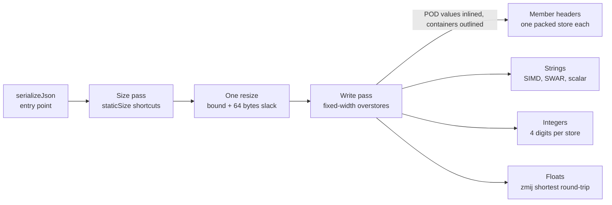

# Jsonifier Serialization: Design and Performance

**Nihilai Collective Corp: Engineering Papers**  
*Nihilai Collective Corp*  
*Jsonifier, November 2026*  

---

## Abstract

Jsonifier serializes a reflection-registered C++ object in two passes: an exact-or-over size estimate, one buffer resize, then a single branch-light write pass that never checks capacity. Every byte the schema already knows (key names, quotes, colons, commas, indentation) is folded at compile time into packed integer constants and emitted with fixed-width stores, so the runtime work left is the data itself: strings, numbers and container lengths.

This paper describes that design as it stands in `include/jsonifier-incl/serializing/` (`serializer.hpp`, `serialize_impl.hpp`) and its helpers for strings (`string_utils.hpp`), integers (`i_to_str.hpp`) and floats (`d_to_str.hpp`).

## Architecture

The whole pipeline is resolved at compile time from `jsonifier::core<T>` and `serialize_options`: one sizing walk, one resize, one write walk.


```mermaid
flowchart LR
    A["serializeJson<br/>entry point"] --> B["Size pass<br/>staticSize shortcuts"]
    B --> C["One resize<br/>bound + 64 bytes slack"]
    C --> D["Write pass<br/>fixed-width overstores"]
    D -- "POD values inlined, containers outlined" --> E["Member headers<br/>one packed store each"]
    D --> F["Strings<br/>SIMD, SWAR, scalar"]
    D --> G["Integers<br/>4 digits per store"]
    D --> H["Floats<br/>zmij shortest round-trip"]
```

The `serialize<options>` dispatcher is a force-inlined (`JSONIFIER_INLINE`) forwarder for every value type: it strips cv and reference qualifiers and calls that type's `serialize_impl` specialization directly. Each registered type gets its own `serialize_impl` specialization: objects, maps, vectors, fixed arrays, tuples, strings, chars, enums, numbers, bools, pointers and optionals, raw JSON, null, and variants (via `visit`).

The serializer is compiled once, for the single instruction-set tier chosen at CMake configure time (detected on the build machine, or named by `JSONIFIER_CPU_INSTRUCTIONS`, and capped with `JSONIFIER_SIMD_TIER`). `serializeJson` calls `serialize<options>::impl` directly, with no CPUID read, function pointer, virtual call or per-call check.

## Key techniques

### Size first, then write without bounds checks

`get_size_impl` computes an upper bound for the output before a byte is written. Fixed-width types report a `staticSize` (numbers and enums 32, `bool` 5, `char` 8, null 4), so a `vector<double>` is sized as `n × 32` plus separators with no loop. Strings are sized at `6n + 2` by default, the worst case where every byte becomes a `\u00XX` escape. With `prescanStrings` set, each string is scanned instead and sized at its exact escaped length plus 2 for the quotes (see *Pre-scanning strings*). Object keys contribute `key.size() + 3` (or `+ 4` when prettified) as a compile-time constant.

`serializeJson` adds 64 bytes of slack and calls `resize_and_overwrite` when the buffer has it, so no zero-fill happens. The write pass then trusts the bound completely: no growth checks, no reallocation, and every writer may overstore (write 8 bytes, advance 4) into the slack.

### Writing through `resize_and_overwrite`

When the output buffer has C++23's `resize_and_overwrite` (detected by the `resize_and_overwriteable_types` concept), the whole write pass runs inside it. `std::string::resize_and_overwrite(n, op)` grows the buffer to at least `n` without initializing it, calls `op(data, n)`, and sets the final size to whatever `op` returns. One call replaces the usual three steps: zero-filling resize, write, shrinking resize.

The `op` Jsonifier passes is `serialize_writer_ro`, a small functor that holds a reference to the object:

```cpp
template<serialize_options options, typename value_type> struct serialize_writer_ro {
	JSONIFIER_INLINE uint64_t operator()(write_buffer_ptr ptrNew, uint64_t) noexcept {
		const write_buffer_ptr bufferPtr = serialize<options>::impl(object, ptrNew, 0);
		return static_cast<uint64_t>(bufferPtr - ptrNew);
	}
	value_type& object;
};
```

- **`operator()` is force-inlined.** `JSONIFIER_INLINE` makes the compiler expand the serializer into the standard library's call site, instead of leaving an out-of-line function that the library calls. The write pass then runs as part of `resize_and_overwrite`'s own body, with the buffer pointer in a register and no extra call frame. Whether `resize_and_overwrite` itself inlines into `serializeJson` is still the compiler's choice.
- **The functor is a reference and a function.** It holds only `value_type& object`, and its copy and move operations are deleted, so passing it costs nothing and the object is never copied.
- **The length comes straight from the pointer.** `operator()` returns the end pointer minus the start, so the final size is set from the write itself, with no second pass and no separate size variable.

Buffers without `resize_and_overwrite` take a fallback: `resize` to the bound if the buffer is smaller, write, then `resize` down to the written length. That path zero-fills on growth.

Single values skip the size pass entirely. A lone number reserves its type's maximum digit count, a lone string `6n + 2` plus one SIMD register, and a lone `bool` 8 bytes, each passed straight to the same `resize_and_overwrite` call.

### Schema text as packed integers

`packed_blitter` turns `"key":` into one constant at compile time. Literals up to 8 bytes become a single 2, 4 or 8-byte integer; longer ones become an array of `uint64_t` rounded up to 16 or a multiple of 32. Writing a member header is one `pow2MemcpyWrapper` store and a pointer bump by the true length.

### Member iteration: CABERIHT

Object members are walked with CABERIHT, Constexpresh Aggregated Bases for Efficient Runtime Iteration of Heterogeneous Types. It is CAFBERIHT without the filter; the full pattern, with compile-time filtering, is described in [its own paper](https://nihilai-collective.net/cafberiht). Each member becomes a base class, and one fold expression over those bases writes the whole object in declaration order.

1. **One base per member.** `get_serialize_base` expands an index sequence over the `core<T>::parseValue` tuple and wraps each entry in `json_entity_serialize<options, entity>`. Each base carries its member's `name`, `memberPtr` and `isItLast` as compile-time constants.
2. **Aggregate the bases.** `serialize_map<bases...>` inherits from every one of them, so a type with 12 members gets one type with 12 bases.
3. **Fold over them.** `iterateValues` is a single fold, `((bufferPtr = bases::processIndex(value, bufferPtr, indent)), ...)`. Each `processIndex` is a static function of its own base, so every call is direct and resolved at compile time.

Inside each `processIndex`, nothing about the member is decided at runtime:

- the header `"name":` is that base's own `packed_blitter` constant;
- the value type is known, so `serialize<options>::impl` picks its writer with no dispatch;
- the trailing comma comes from `if constexpr (!isItLast)`, not an index check.

The sizing pass uses the same pattern: `size_getter_map` aggregates `json_entity_size` bases and folds `processIndex` over them, so both passes walk members the same way.

The result is no virtual calls, no `std::tuple` `get<I>` recursion, no runtime member index and no loop over members. A whole object becomes straight-line code: a run of fixed stores for headers and commas, with the value writers in between. The CAFBERIHT paper measures this same fold-over-bases dispatch as zero overhead against a hand-written baseline by assembly diff.

Runtime key exclusion (`jsonifierExcludedKeys`) is a separate mechanism, a set lookup inside each `processIndex` (see Limitations).

### Copies have a compile-time power-of-2 size

Nearly every copy on the write path has a power-of-2 size fixed at compile time: 2, 4 or 8 bytes. `pow2MemcpyWrapper<size>` takes the size as a template argument and `static_assert`s `std::has_single_bit(size)`, so a copy of any other size will not compile. A `memcpy` of 2, 4 or 8 bytes known at compile time lowers to a single unaligned load and store, with no call, no length branch and no tail loop.

What this does to the generated code:

| Copy | Typical x86-64 | Typical ARM64 |
| --- | --- | --- |
| `std::memcpy`, runtime length | `call memcpy` (or an inline length dispatch with branches and a tail loop) | `bl memcpy` |
| `jsonifierMemcpy`, runtime length under 256 bytes | at most four compare-and-branch steps on the length (no jump table), then two overlapping 1 to 128-byte copies, each split into register-width load–store pairs | the same, with `ldr`/`str` or `ldr q`/`str q` pairs |
| `jsonifierMemcpy`, runtime length of 256 bytes or more | `call memcpy` | `bl memcpy` |
| Compile-time 7 bytes | two overlapping 4-byte moves, or 4 + 2 + 1 | several loads and stores |
| Compile-time 2 / 4 / 8 bytes | one `mov` load, one `mov` store | one `ldrh`/`ldr` and one `strh`/`str` |
| Compile-time 2 / 4 / 8 bytes of constant data | one immediate store, no load (`mov qword ptr [rdi], imm`) | a constant materialized in a register, then one `str` |

- **No call.** A call to `memcpy` clobbers every caller-saved register, so live values have to be spilled and reloaded around it. Without the call, the buffer pointer and the values being written stay in registers for the whole member loop.
- **No length branches.** A runtime `memcpy` has to dispatch on the length before it copies anything. A fixed-size copy has no branch to predict or mispredict.
- **Constants become immediates.** Key headers, `true`/`false` and the empty `{}`/`[]`/`""` literals are compile-time data. Their copies can fold into immediate stores, so writing a member header needs no memory read at all.
- **Runtime lengths stay short.** Copies whose length is only known at run time, such as the runs that Minify and Prettify carry over, go through `jsonifierMemcpy` (`utility.hpp`). It sorts the length into a power-of-2 bucket `b`, where `b ≤ length < 2b`, and copies the first `b` bytes and the last `b` bytes. The two copies overlap, so any length from 2 to 255 bytes takes one fixed-size copy pair (a single byte takes one store), with no loop and no tail. Buckets wider than the vector register are split into register-width moves: the 128-byte bucket is 8 moves on AVX2, 4 on AVX-512 and 16 on SSE or NEON. Only lengths of 256 bytes or more reach `std::memcpy`. `jsonifierMemcpyUpTo<maxBytes>` takes a compile-time upper bound and leaves out every bucket above it, so a caller whose length is bounded never pays for the cases it cannot hit.
- **The bucket is chosen by a compare tree, not a jump table.** `dispatchBuckets` is a balanced binary tree of `length < 2^k` tests generated at compile time, so the bucket is found in at most four conditional branches on the length itself, with no `lzcnt` and no indirect jump. A switch on `std::bit_width(length)` compiled to a jump table on GCC and lost to glibc's `memcpy`; the tree compiles to the same branch-only shape on GCC and Clang, and in the [memcpy-decomp](https://github.com/nihilai-collective/memcpy-decomp) harness it beats `std::memcpy` on every range tested, from 1–15 to 1–129 bytes, on all five platforms.
- **Inlining and scheduling.** Each copy is one or two instructions, so a whole object's serializer inlines into straight-line code. The compiler can then interleave stores from neighbouring members with the value work between them.

**What actually reaches `jsonifierMemcpy`.** We counted the length of every call to `jsonifierMemcpy` and `jsonifierMemcpyUpTo`, separately, over one instrumented run. The counters were a temporary patch and are not in the library.

| Length | `jsonifierMemcpy` calls | Share | `jsonifierMemcpyUpTo` calls | Share |
| --- | --- | --- | --- | --- |
| 0 | 13,040 | 1.16% | 0 | 0.00% |
| 1 | 4,012 | 0.36% | 938 | 0.22% |
| 2–3 | 9,592 | 0.85% | 1,891 | 0.44% |
| 4–7 | 22,641 | 2.01% | 8,303 | 1.93% |
| 8–15 | 185,573 | 16.47% | 411,279 | 95.82% |
| 16–31 | 735,745 | 65.29% | 6,797 | 1.58% |
| 32–63 | 149,125 | 13.23% | 0 | 0.00% |
| 64–127 | 6,552 | 0.58% | 0 | 0.00% |
| 128–255 | 312 | 0.03% | 0 | 0.00% |
| 256 or more (`std::memcpy`) | 351 | 0.03% | 1 | 0.00% |
| **Total** | **1,126,943** | | **429,209** | |

Two lengths dominate `jsonifierMemcpy`: exactly 16 bytes (659,358 calls, 58.5%) and exactly 32 bytes (146,188 calls, 13.0%), with a smaller spike at exactly 64 (3,688 calls). That matches the member-header blit, whose length `lengthToCopy` is the key literal rounded up to 16, 32 or 64 bytes. Those calls carry a template-constant length, so they fold to fixed-size vector stores. Of the 1,126,943 calls, 99.69% are 64 bytes or less, and only 351 (0.03%) are 256 bytes or more and reach `std::memcpy`.

`jsonifierMemcpyUpTo` is narrower still. 95.8% of its 429,209 calls fall in the 8–15 bucket, led by 10 bytes (31.8%) and 9 bytes (22.4%), and every call but one is 31 bytes or less. The one exception was a single 339-byte copy, which took the `std::memcpy` fallback.

That is why the writers round up and overstore instead of copying exact lengths. A 5-byte `false` is one 8-byte store. A 3-digit group is a 4-byte load followed by a 2-byte and a 1-byte store. A 7-byte key literal is one 8-byte store. The pointer then advances by the true length, and the size pass's slack absorbs the extra bytes.

Key literals longer than 8 bytes copy 16 bytes, or a multiple of 32, through `jsonifierMemcpy` rather than `pow2MemcpyWrapper`. That is why they appear in the counts above, but `lengthToCopy` is still a compile-time constant, so the force-inlined call folds its length dispatch away. The only copies whose length is known only at runtime are off the common path: escape sequences inside strings (only when an escapable byte is found), raw JSON passthrough, and the memset for indents deeper than 8 levels.

### Booleans: one subtraction, one store

A `bool` becomes JSON with no branch and no table lookup. Two 64-bit constants are built at compile time, each in the native byte order:

- `falseVInt` holds the bytes `false` packed into one word (435728179558, `0x65736C6166` on little-endian).
- `trueVInt` holds the difference between the `false` word and the `true` word (434025983730), not the `true` word itself.

The writer computes `state = falseVInt - value × trueVInt`. When `value` is 0 the result is the `false` word. When it is 1 the difference cancels and the `true` word is left. One 8-byte store writes it, and the pointer advances by `5 - value`, so `true` moves 4 bytes and `false` moves 5. The extra bytes land in the slack the size pass reserved (5 bytes per bool plus 64 at the end) and are overwritten by whatever comes next.

On the Bool test this writer leads Glaze by 10.55–17.26× freshly allocated on all five builds.

### Strings: picked by length

`string_serializer::impl` sorts every string into one of three length classes before it touches a byte. In all three the escapable bytes are the same: `"`, `\` and anything below 0x20.

1. **Under 16 bytes: one page-safe vector.** If the source does not sit within 16 bytes of the end of a 4 KiB page, `pageSafeShortImpl` loads a full 16-byte vector, masks its escape bits to the string's true length and, when nothing is set, stores all 16 bytes and advances by the length. A short clean key or value is one load, one test and one store, with no branch on its length. Reading past the string's end cannot fault, because the page check guarantees the 16 bytes are mapped; under ASan the load moves into a `JSONIFIER_NO_SANITIZE_ADDRESS` helper so the sanitizer does not flag it. Near a page end the string falls back to two overlapping 4- or 2-byte loads (`smallImpl`) below 8 bytes, or SWAR on 64-bit words (`swarFinish`) from 8 to 15.
2. **16 to 64 bytes: head and tail.** `mediumImpl` loads one vector from the start of the string and one ending at its last byte, tests both and, when both are clean, stores both. The two overlap in the middle, so any length in the range is covered with no loop and no remainder: 16-byte vectors up to 32 bytes, then 32-byte vectors on AVX2, or two 16-byte head-and-tail pairs over 32-byte halves where the widest register is 16 bytes. A string with any escapable byte returns `false` and takes the general path.
3. **Everything else: check first, then store.** The general path walks the widest available SIMD width down to the narrowest, testing each block before storing it. A clean block is stored and advances the full width; a dirty one is split into 16-byte lanes (`escapeLane`), which copy the clean runs at their exact lengths and write each escape from a 256-entry table. The last partial block is one 16-byte load ending at the string's last byte (`overlappedFinish`), with its escape mask shifted down to the bytes not yet written, and clean bytes are copied at their exact length.

### Integers: exact length first, then 4 digits per store

Integers go through `to_chars` in `i_to_str.hpp` in three steps.

1. **Width.** In `serialize_impl`, every integer narrower than 64 bits is widened to `uint64_t` or `int64_t`, so one writer per signedness covers all eight integer types.
2. **Sign.** A negative value writes `'-'` and then takes its absolute value without a branch: `(v ^ (v >> 63)) - (v >> 63)` on the unsigned type. Because the result is unsigned, `INT64_MIN` works too.
3. **Length.** A balanced tree of comparisons against powers of ten picks the exact digit count, 1 to 20, in at most 5 compares. Each count has its own fixed writer (`to_chars_internal<v_type, N>`), so the writer knows at compile time where every digit goes and never reverses or shifts its output.

The writers use three lookup tables built at compile time: 100 two-digit entries, 1,000 three-digit entries and 10,000 four-digit entries, each digit group pre-packed as characters. Writing four digits is one 4-byte copy from the 10,000-entry table.

Divisions are replaced by multiplies:

- **Divide by 10^4** inside an 8-digit block: multiply by 3518437209 and shift right 45.
- **Divide by 10^8** for longer values: take the high bits of a 128-bit product with 12379400392853802749 and shift right 90 in total. GCC and Clang use `__uint128_t`, MSVC uses `_umul128`, and other compilers fall back to `mulhiPortable`.

So a 20-digit `uint64_t` is two 10^8 splits, four 10^4 splits and five 4-byte stores, with no loop and no per-digit work. A 3-digit group, as at the front of a 19-digit value, is one 4-byte table load followed by a 2-byte and a 1-byte store, so nothing is written past the 3 digits.

With the string reused, Jsonifier leads the fastest other library on Int64 and Uint64 on every build, by 1.31× to 4.90×.

### Floats

Doubles go through `zmij::detail::write`, a shortest-round-trip formatter vendored in `zmij.hpp`.

## Minified and prettified output

`serialize_options` carries `prettify`, `indentSize` (default 3), `indentChar` (default space) and `prescanStrings` (default false) as template parameters, so the two modes compile to separate code with no runtime mode check.

| Piece | Minified | Prettified |
| --- | --- | --- |
| Member header | `"key":` packed store | `"key": ` packed store |
| Separator | one `,` byte | `indent_table<",\n">` blit |
| Open / close | one `{` / `}` byte | `"{\n"` + indent, `"\n"` + indent, then `}` |
| Size estimate per member | `key + 3` | `key + 4`, plus `2 + indent` per separator |

`indent_table` prebuilds, at compile time, the prefix (`,\n`, `{\n` or `\n`) followed by 8 levels of indent characters as a packed `uint64_t` array. A newline plus indent is a short run of 8-byte stores from that table, rounded up into the slack. Nesting deeper than 8 levels falls back to `memset` for the remainder, marked `[[unlikely]]`.

This prettify path is the direct one, used when serializing an object. Prettifying existing JSON text is a separate path (`prettifier.hpp`) built on the stage-1 structural index described in *Two Stages, On Demand*.

## Performance results

Jsonifier was fastest in 247 of the 255 write tests on five builds, tied 3 and lost 5. With the output string reused across iterations it was fastest in 251 of 255, tied 1 and lost 3. Each build runs 51 write tests: five single-value tests, eleven corpus documents in minified and prettified form, the same eleven documents as "Small" cut-down copies (at most 5 KiB minified) in both forms, and the Minify and Prettify reformatting tests. Jsonifier wins Minify and Prettify on every build in both runs. Freshly allocated, the only loss to Glaze is minified Twitter on Windows / MSVC; the other four are against simdjson's reflection writer, which exists only on GCC: Double, minified Marine IK Small and Marine IK Reverse Small on Linux / GCC, and Double on macOS / GCC. The three freshly allocated ties are all on macOS / GCC against the reflection writer: Uint64, minified CitmCatalog and minified Twitter Small. Reused, the three losses are minified Marine IK Small and Marine IK Reverse Small on Linux / GCC and String on macOS / GCC, all against the reflection writer, and the one tie is Double on macOS / GCC. Linux / Clang and macOS / Clang win all 51 tests in both runs, and Windows / MSVC wins all 51 reused. Prettified documents are where the lead is widest. Freshly allocated, full-size documents lead Glaze by 1.44–10.58× across the five builds and the reflection writer by 16–69× on the two GCC builds; Small documents lead them by 1.37–10.51× and 12.10–60.37×.

These results come from the [Json-Performance](https://github.com/nihilai-collective/Json-Performance) sweep published November 4, 2026, with Jsonifier [28b18c4](https://github.com/nihilai-collective/jsonifier/commit/28b18c4), Glaze [1717bb0](https://github.com/stephenberry/glaze/commit/1717bb0), simdjson [ebd28cb](https://github.com/simdjson/simdjson/commit/ebd28cb) and BenchmarkSuite [ed43ce8](https://github.com/nihilai-collective/benchmarksuite/commit/ed43ce8) on every build. Sampling and tie rules match those in *Two Stages, On Demand*. `simdjson (reflection)` is simdjson 5's C++26 `to_json`. It only runs on GCC, which has P2996 reflection. Its writer has no single-pass pretty mode, so its prettified results are a small fraction of its minified throughput. The Minify and Prettify tests reformat existing JSON text instead of serializing objects; they compare Jsonifier against Glaze and simdjson On Demand and are counted with the rest.

### Method

**Hardware and builds.**

| Build | CPU | OS | Jsonifier | Glaze (string escape / float write) | simdjson |
| --- | --- | --- | --- | --- | --- |
| Linux / Clang 24.0 | Intel Core i9-14900KF | Linux 7.0.0-42 | AVX2 | AVX2 / SSE4.1 | haswell |
| Linux / GCC 16.2 | Intel Core i9-14900KF | Linux 7.0.0-42 | AVX2 | AVX2 / SSE4.1 | haswell |
| macOS / Clang 23.1 | Apple M2 Pro (virtual) | macOS 25.6.0 | NEON | NEON / NEON | arm64 |
| macOS / GCC 16.2 | Apple M2 Pro (virtual) | macOS 25.6.0 | NEON | NEON / NEON | arm64 |
| Windows / MSVC 19.51 | Intel Core i9-14900KF | Windows 10.0.26200 | AVX2 | AVX2 / SSE4.1 | haswell |

Each library picks its own instruction set at build or run time; the table lists what produced these results. Glaze reports a backend per subsystem, so its string escaper and float writer can differ within one build.

**What is timed.** Every test runs twice. In the freshly allocated run, each iteration constructs a new output string, serializes into it, and destroys it, all inside the timed region, so allocation and deallocation are part of every measurement. In the reused run, labelled "(Reused)" in the sweep, the string is created once and held across iterations; it is cleared, keeping its capacity, outside the timed region before each iteration, so only the serialize work is measured. Both runs are tabulated below, freshly allocated first. The "Small" documents are cut-down copies of each corpus document, at most 5 KiB minified, and measure per-call overhead more than steady-state throughput. CPU caches are cleared before iterations. All libraries serialize the same test data.

**Throughput.** MB/s counts output bytes: each iteration is credited with the size of the JSON string that library produced, and throughput is total bytes over total time in the kept epoch window. MB here means 2²⁰ bytes. Output sizes can differ slightly between libraries for the same data, because each formats floats in its own way; on the Double test, for example, Glaze writes 1,798 bytes, Jsonifier 1,811 and simdjson's reflection writer 1,997. Each library is credited with its own output size. Ratios are computed from unrounded throughput, so one recomputed from the rounded values shown can differ in the last digit.

**Sampling.**

1. Iterations start at 100 and double each epoch (100, 200, 400, …) up to 100,000.
2. Each epoch runs all its iterations and evaluates a trailing window of max(iterations / 10, 30) samples, capped at 100,000.
3. Sampling never stops early: epochs continue until 5 seconds have elapsed or the iteration cap is reached.
4. Every epoch after the first is scored by its relative standard error plus its epoch-over-epoch mean shift, and the lowest-scoring epoch is kept as the result.

**Convergence.** A kept epoch counts as converged only if its RSE is under 5% and its mean shift under 2.5% on the three x86 builds, or under 10% and 5% on the virtualized M2 Pro. Non-converged results are included in the rankings and in the win, tie and loss counts. Each one is marked n/c in the tables below, and a test with a non-converged result should be read with reduced statistical confidence.

**Ranking.** Variance is Bessel-corrected. Two libraries tie when Welch's t-test (two-sided, p < 0.05) cannot separate their kept epochs. Jsonifier is counted as a win when it ranks first and no other library is statistically tied with it, as a tie when it is statistically tied with another library at its rank, and as a loss when another library ranks above it and none is tied with it. A tie is therefore usually at the top, and every tie in this sweep is.

**Caveats.** Keeping the quietest epoch favours each library's least-disturbed stretch, which raises absolute throughput somewhat, but the rule applies identically to every library. The M2 Pro numbers were taken in a virtual machine, so absolute MB/s may differ from bare metal; within a build, every library ran in the same environment.

| Platform / compiler | Write tests | Jsonifier fastest | Tied | Jsonifier lost |
| --- | --- | --- | --- | --- |
| Windows / MSVC 19.51 (i9-14900KF, AVX2) | 51 | 50 | 0 | 1 |
| Linux / Clang 24.0 (i9-14900KF, AVX2) | 51 | 51 | 0 | 0 |
| Linux / GCC 16.2 (i9-14900KF, AVX2) | 51 | 48 | 0 | 3 |
| macOS / GCC 16.2 (Apple M2 Pro, NEON) | 51 | 47 | 3 | 1 |
| macOS / Clang 23.1 (Apple M2 Pro, NEON) | 51 | 51 | 0 | 0 |
| **Total** | **255** | **247** | **3** | **5** |

Every write test per build follows, in MB/s, freshly allocated run first and reused run after it. Results marked n/c did not converge. Bool, Double, Int64, String and Uint64 serialize individual values one at a time in a loop. The rest serialize whole documents, and each build's second table holds the two reformatting tests. *Lead* is Jsonifier's throughput divided by the fastest other library's, so a value under 1 is a loss.

### Windows / MSVC 19.51 (i9-14900KF, AVX2)

| Test | Jsonifier | Glaze | Lead |
| --- | --- | --- | --- |
| Bool | 1,184 | 92 | 12.90× |
| Double | 465 | 151 | 3.07× |
| Int64 | 524 | 366 | 1.43× |
| String | 1,443 | 908 | 1.59× |
| Uint64 | 549 | 387 | 1.42× |
| Apache Builds (minified) | 13,005 | 4,409 | 2.95× |
| Canada (minified) | 1,270 | 902 | 1.41× |
| Apache Builds (prettified) | 13,842 | 4,754 | 2.91× |
| Canada (prettified) | 2,950 | 1,523 | 1.94× |
| CitmCatalog (minified) | 8,371 | 4,402 | 1.90× |
| CitmCatalog (prettified) | 4,430 | 1,879 | 2.36× |
| Discord (minified) | 10,652 | 4,109 | 2.59× |
| Discord (prettified) | 13,104 | 3,915 | 3.35× |
| Github Events (minified) | 11,402 | 4,775 | 2.39× |
| Google Maps Response (minified) | 8,956 | 3,421 | 2.62× |
| Github Events (prettified) | 13,386 | 3,117 | 4.29× |
| Google Maps Response (prettified) | 14,280 | 5,300 | 2.69× |
| Instruments (minified) | 13,607 | 4,389 | 3.10× |
| Instruments (prettified) | 18,381 | 4,072 | 4.51× |
| Marine IK Reverse (minified) | 891 | 725 | 1.23× |
| Marine IK Reverse (prettified) | 3,226 | 1,959 | 1.65× |
| Marine IK (minified) | 888 | 645 | 1.38× |
| Marine IK (prettified) | 3,220 | 1,310 (n/c) | 2.46× |
| Random (minified) | 3,602 | 3,114 | 1.16× |
| Random (prettified) | 3,953 | 2,204 | 1.79× |
| Twitter (minified) | 3,829 | 4,549 | 0.84× |
| Twitter (prettified) | 4,075 | 1,719 | 2.37× |
| Apache Builds Small (minified) | 9,368 | 3,496 | 2.68× |
| Canada Small (minified) | 1,797 | 1,224 | 1.47× |
| Apache Builds Small (prettified) | 12,066 | 3,852 | 3.13× |
| Canada Small (prettified) | 5,226 | 2,953 | 1.77× |
| CitmCatalog Small (minified) | 6,736 | 3,301 | 2.04× |
| CitmCatalog Small (prettified) | 11,773 | 3,957 | 2.98× |
| Discord Small (minified) | 9,235 | 3,526 | 2.62× |
| Discord Small (prettified) | 10,049 | 3,300 | 3.05× |
| Github Events Small (minified) | 9,956 | 4,160 | 2.39× |
| Google Maps Response Small (minified) | 9,075 | 3,601 | 2.52× |
| Github Events Small (prettified) | 12,325 | 3,785 | 3.26× |
| Google Maps Response Small (prettified) | 15,752 | 4,744 | 3.32× |
| Instruments Small (minified) | 10,697 | 4,050 | 2.64× |
| Instruments Small (prettified) | 16,501 | 2,948 | 5.60× |
| Marine IK Reverse Small (minified) | 1,523 | 958 | 1.59× |
| Marine IK Reverse Small (prettified) | 6,481 | 2,800 | 2.31× |
| Marine IK Small (minified) | 1,405 | 962 | 1.46× |
| Marine IK Small (prettified) | 6,600 | 2,871 | 2.30× |
| Random Small (minified) | 8,981 | 3,368 | 2.67× |
| Random Small (prettified) | 14,642 | 3,983 | 3.68× |
| Twitter Small (minified) | 9,829 | 4,438 | 2.21× |
| Twitter Small (prettified) | 10,881 | 3,239 | 3.36× |

| Reformatting test | Jsonifier | Glaze | simdjson (ondemand) | Lead |
| --- | --- | --- | --- | --- |
| Minify | 2,939 | 1,939 | 1,307 | 1.52× |
| Prettify | 2,327 | 2,221 | 1,346 | 1.05× |

### Linux / Clang 24.0 (i9-14900KF, AVX2)

| Test | Jsonifier | Glaze | Lead |
| --- | --- | --- | --- |
| Bool | 2,763 | 227 | 12.18× |
| Double | 340 | 322 | 1.06× |
| Int64 | 1,012 | 942 | 1.07× |
| String | 4,807 | 2,165 | 2.22× |
| Uint64 | 1,026 | 928 | 1.10× |
| Apache Builds (minified) | 16,609 | 5,604 | 2.96× |
| Canada (minified) | 1,953 | 944 | 2.07× |
| Apache Builds (prettified) | 19,290 | 5,287 | 3.65× |
| Canada (prettified) | 4,678 | 3,258 | 1.44× |
| CitmCatalog (minified) | 10,611 | 5,638 | 1.88× |
| CitmCatalog (prettified) | 17,688 | 5,792 | 3.05× |
| Discord (minified) | 14,136 | 6,448 | 2.19× |
| Discord (prettified) | 17,989 | 5,242 | 3.43× |
| Github Events (minified) | 17,659 | 6,893 | 2.56× |
| Google Maps Response (minified) | 13,108 | 4,366 | 3.00× |
| Github Events (prettified) | 20,483 | 5,710 | 3.59× |
| Google Maps Response (prettified) | 18,537 | 5,603 | 3.31× |
| Instruments (minified) | 19,370 | 5,678 | 3.41× |
| Instruments (prettified) | 23,089 | 5,759 | 4.01× |
| Marine IK Reverse (minified) | 1,211 | 614 | 1.97× |
| Marine IK Reverse (prettified) | 5,969 | 3,502 | 1.70× |
| Marine IK (minified) | 1,209 | 595 | 2.03× |
| Marine IK (prettified) | 5,795 | 2,775 | 2.09× |
| Random (minified) | 14,794 | 3,751 | 3.94× |
| Random (prettified) | 17,765 | 4,101 | 4.33× |
| Twitter (minified) | 19,080 | 7,055 | 2.70× |
| Twitter (prettified) | 19,714 | 4,720 | 4.18× |
| Apache Builds Small (minified) | 14,031 | 4,932 | 2.84× |
| Canada Small (minified) | 1,971 | 975 | 2.02× |
| Apache Builds Small (prettified) | 19,009 | 4,629 | 4.11× |
| Canada Small (prettified) | 5,210 | 3,815 | 1.37× |
| CitmCatalog Small (minified) | 10,704 | 5,165 | 2.07× |
| CitmCatalog Small (prettified) | 19,122 | 5,356 | 3.57× |
| Discord Small (minified) | 13,554 | 5,987 | 2.26× |
| Discord Small (prettified) | 18,549 | 5,006 | 3.71× |
| Github Events Small (minified) | 15,918 | 7,023 | 2.27× |
| Google Maps Response Small (minified) | 12,833 | 4,867 | 2.64× |
| Github Events Small (prettified) | 22,294 | 5,235 | 4.26× |
| Google Maps Response Small (prettified) | 25,192 | 5,645 | 4.46× |
| Instruments Small (minified) | 17,712 | 5,561 | 3.19× |
| Instruments Small (prettified) | 27,546 | 5,924 | 4.65× |
| Marine IK Reverse Small (minified) | 1,584 | 896 | 1.77× |
| Marine IK Reverse Small (prettified) | 7,060 | 4,250 | 1.66× |
| Marine IK Small (minified) | 1,718 | 891 | 1.93× |
| Marine IK Small (prettified) | 7,983 | 4,373 | 1.83× |
| Random Small (minified) | 16,261 | 4,898 | 3.32× |
| Random Small (prettified) | 27,296 | 4,743 | 5.75× |
| Twitter Small (minified) | 12,714 | 7,656 | 1.66× |
| Twitter Small (prettified) | 18,265 | 5,491 | 3.33× |

| Reformatting test | Jsonifier | Glaze | simdjson (ondemand) | Lead |
| --- | --- | --- | --- | --- |
| Minify | 3,678 | 2,593 | 1,779 | 1.42× |
| Prettify | 5,725 | 4,220 | 2,275 | 1.36× |

### Linux / GCC 16.2 (i9-14900KF, AVX2)

| Test | Jsonifier | Glaze | simdjson (reflection) | Lead |
| --- | --- | --- | --- | --- |
| Bool | 2,121 | 201 | 254 | 8.36× |
| Double | 268 | 306 | 345 | 0.78× |
| Int64 | 957 | 827 | 951 | 1.01× |
| String | 4,009 | 2,043 | 3,670 | 1.09× |
| Uint64 | 946 | 886 | 923 | 1.03× |
| Apache Builds (minified) | 20,435 | 7,999 | 13,604 | 1.50× |
| Canada (minified) | 2,188 | 1,453 | 1,045 | 1.51× |
| Apache Builds (prettified) | 23,311 | 7,087 | 608 | 3.29× |
| Canada (prettified) | 6,170 | 3,258 | 396 | 1.89× |
| CitmCatalog (minified) | 12,933 | 6,042 | 10,314 | 1.25× |
| CitmCatalog (prettified) | 20,722 | 6,001 | 587 | 3.45× |
| Discord (minified) | 15,406 | 6,325 | 11,685 | 1.32× |
| Discord (prettified) | 20,651 | 6,214 | 507 | 3.32× |
| Github Events (minified) | 14,621 | 6,900 | 9,823 | 1.49× |
| Google Maps Response (minified) | 16,218 | 4,261 | 9,658 | 1.68× |
| Github Events (prettified) | 18,335 | 5,421 | 588 | 3.38× |
| Google Maps Response (prettified) | 20,562 | 6,926 | 520 | 2.97× |
| Instruments (minified) | 20,485 | 5,778 | 15,903 | 1.29× |
| Instruments (prettified) | 27,052 | 6,056 | 492 | 4.47× |
| Marine IK Reverse (minified) | 1,306 | 996 | 888 | 1.31× |
| Marine IK Reverse (prettified) | 6,433 | 3,722 | 272 | 1.73× |
| Marine IK (minified) | 1,308 | 968 | 898 | 1.35× |
| Marine IK (prettified) | 6,544 | 3,196 | 389 | 2.05× |
| Random (minified) | 15,641 | 4,223 | 11,818 | 1.32× |
| Random (prettified) | 20,562 | 5,152 | 508 | 3.99× |
| Twitter (minified) | 17,615 | 7,823 | 10,271 | 1.71× |
| Twitter (prettified) | 21,250 | 5,323 | 515 | 3.99× |
| Apache Builds Small (minified) | 11,753 | 4,410 | 7,435 | 1.58× |
| Canada Small (minified) | 1,800 | 1,581 | 1,076 | 1.14× |
| Apache Builds Small (prettified) | 13,294 | 4,006 | 615 | 3.32× |
| Canada Small (prettified) | 6,275 | 3,443 | 417 | 1.82× |
| CitmCatalog Small (minified) | 7,720 | 3,475 | 5,402 | 1.43× |
| CitmCatalog Small (prettified) | 15,260 | 3,810 | 527 | 4.00× |
| Discord Small (minified) | 10,925 | 4,189 | 6,883 | 1.59× |
| Discord Small (prettified) | 15,658 | 3,920 | 517 | 3.99× |
| Github Events Small (minified) | 8,258 | 5,154 | 5,993 | 1.38× |
| Google Maps Response Small (minified) | 13,573 | 4,016 | 8,087 | 1.68× |
| Github Events Small (prettified) | 10,895 | 4,093 | 571 | 2.66× |
| Google Maps Response Small (prettified) | 23,586 | 5,875 | 532 | 4.01× |
| Instruments Small (minified) | 12,443 | 3,887 | 7,984 | 1.56× |
| Instruments Small (prettified) | 20,724 | 3,701 | 557 | 5.60× |
| Marine IK Reverse Small (minified) | 1,257 | 1,238 | 1,494 | 0.84× |
| Marine IK Reverse Small (prettified) | 6,546 | 3,804 | 508 | 1.72× |
| Marine IK Small (minified) | 1,255 | 1,199 | 1,515 | 0.83× |
| Marine IK Small (prettified) | 6,455 | 3,736 | 533 | 1.73× |
| Random Small (minified) | 12,283 | 4,402 | 8,087 | 1.52× |
| Random Small (prettified) | 23,059 | 4,907 | 557 | 4.70× |
| Twitter Small (minified) | 8,803 | 6,083 | 6,377 | 1.38× |
| Twitter Small (prettified) | 12,291 | 4,188 | 614 | 2.93× |

| Reformatting test | Jsonifier | Glaze | simdjson (ondemand) | Lead |
| --- | --- | --- | --- | --- |
| Minify | 3,327 | 2,394 | 1,848 | 1.39× |
| Prettify | 4,355 | 3,719 | 2,631 | 1.17× |

### macOS / GCC 16.2 (Apple M2 Pro, NEON)

| Test | Jsonifier | Glaze | simdjson (reflection) | Lead |
| --- | --- | --- | --- | --- |
| Bool | 2,253 | 131 | 234 | 9.65× |
| Double | 286 | 228 | 297 | 0.96× |
| Int64 | 836 | 430 | 824 | 1.01× |
| String | 1,317 | 1,069 | 1,066 | 1.23× |
| Uint64 | 848 | 510 | 845 | 1.00× |
| Apache Builds (minified) | 12,443 | 5,471 | 9,218 | 1.35× |
| Canada (minified) | 2,182 | 1,508 | 773 | 1.45× |
| Apache Builds (prettified) | 13,230 | 4,483 | 364 | 2.95× |
| Canada (prettified) | 7,200 | 2,998 (n/c) | 275 | 2.40× |
| CitmCatalog (minified) | 7,925 | 1,918 | 7,930 | 1.00× |
| CitmCatalog (prettified) | 21,088 | 3,794 | 350 | 5.56× |
| Discord (minified) | 10,163 | 2,959 | 7,211 | 1.41× |
| Discord (prettified) | 14,988 | 2,528 | 374 | 5.93× |
| Github Events (minified) | 14,978 | 3,856 | 11,608 | 1.29× |
| Google Maps Response (minified) | 11,187 | 1,547 | 8,046 | 1.39× |
| Github Events (prettified) | 16,722 (n/c) | 3,581 | 452 | 4.67× |
| Google Maps Response (prettified) | 20,732 | 2,934 | 299 | 7.07× |
| Instruments (minified) | 14,487 | 1,762 | 2,183 | 6.64× |
| Instruments (prettified) | 14,725 | 2,259 | 320 | 6.52× |
| Marine IK Reverse (minified) | 1,394 (n/c) | 939 | 783 | 1.49× |
| Marine IK Reverse (prettified) | 6,812 | 3,174 | 293 | 2.15× |
| Marine IK (minified) | 1,225 | 778 | 682 | 1.57× |
| Marine IK (prettified) | 5,857 | 2,536 | 276 (n/c) | 2.31× |
| Random (minified) | 10,470 | 1,981 | 6,787 | 1.54× |
| Random (prettified) | 14,559 | 2,227 | 370 | 6.54× |
| Twitter (minified) | 15,854 | 4,141 | 10,481 | 1.51× |
| Twitter (prettified) | 16,515 | 3,181 | 436 | 5.19× |
| Apache Builds Small (minified) | 9,686 | 3,000 | 6,858 | 1.41× |
| Canada Small (minified) | 1,894 | 1,327 | 813 | 1.43× |
| Apache Builds Small (prettified) | 8,936 | 3,361 | 323 | 2.66× |
| Canada Small (prettified) | 5,905 | 3,032 | 243 | 1.95× |
| CitmCatalog Small (minified) | 8,416 | 1,740 | 7,557 | 1.11× |
| CitmCatalog Small (prettified) | 14,174 | 2,395 | 332 | 5.92× |
| Discord Small (minified) | 11,849 | 2,464 | 8,543 | 1.39× |
| Discord Small (prettified) | 12,602 | 2,130 | 357 | 5.92× |
| Github Events Small (minified) | 10,061 (n/c) | 2,938 | 8,118 | 1.24× |
| Google Maps Response Small (minified) | 10,230 | 1,718 | 7,898 | 1.30× |
| Github Events Small (prettified) | 14,046 | 2,739 | 361 | 5.13× |
| Google Maps Response Small (prettified) | 19,801 | 2,593 | 328 | 7.64× |
| Instruments Small (minified) | 13,866 | 1,802 | 7,472 | 1.86× |
| Instruments Small (prettified) | 15,135 | 2,144 | 340 | 7.06× |
| Marine IK Reverse Small (minified) | 1,782 | 981 | 1,395 | 1.28× |
| Marine IK Reverse Small (prettified) | 7,948 | 3,116 | 298 | 2.55× |
| Marine IK Small (minified) | 1,723 | 1,007 | 1,535 | 1.12× |
| Marine IK Small (prettified) | 8,122 | 2,857 | 296 | 2.84× |
| Random Small (minified) | 10,510 | 1,933 | 9,654 | 1.09× |
| Random Small (prettified) | 13,798 | 2,617 | 309 | 5.27× |
| Twitter Small (minified) | 8,072 | 2,822 | 7,683 | 1.05× |
| Twitter Small (prettified) | 13,780 | 2,970 | 444 | 4.64× |

| Reformatting test | Jsonifier | Glaze | simdjson (ondemand) | Lead |
| --- | --- | --- | --- | --- |
| Minify | 2,453 | 1,600 | 1,239 | 1.53× |
| Prettify | 3,002 | 2,361 | 1,534 | 1.27× |

### macOS / Clang 23.1 (Apple M2 Pro, NEON)

| Test | Jsonifier | Glaze | Lead |
| --- | --- | --- | --- |
| Bool | 1,636 | 113 | 14.41× |
| Double | 245 | 172 | 1.42× |
| Int64 | 2,919 | 456 | 6.40× |
| String | 1,070 | 1,004 | 1.07× |
| Uint64 | 2,383 | 439 | 5.43× |
| Apache Builds (minified) | 10,798 | 3,008 | 3.59× |
| Canada (minified) | 2,238 | 1,722 | 1.30× |
| Apache Builds (prettified) | 14,093 | 3,741 | 3.77× |
| Canada (prettified) | 6,919 | 2,998 | 2.31× |
| CitmCatalog (minified) | 7,612 | 1,922 | 3.96× |
| CitmCatalog (prettified) | 18,621 | 2,873 | 6.48× |
| Discord (minified) | 12,276 | 2,529 | 4.85× |
| Discord (prettified) | 17,307 | 2,407 | 7.19× |
| Github Events (minified) | 12,618 | 3,901 | 3.23× |
| Google Maps Response (minified) | 10,020 | 1,613 | 6.21× |
| Github Events (prettified) | 18,140 | 3,407 | 5.32× |
| Google Maps Response (prettified) | 19,728 | 2,438 | 8.09× |
| Instruments (minified) | 13,940 | 2,095 | 6.65× |
| Instruments (prettified) | 24,813 | 2,346 | 10.58× |
| Marine IK Reverse (minified) | 1,562 | 955 | 1.64× |
| Marine IK Reverse (prettified) | 7,493 | 3,434 | 2.18× |
| Marine IK (minified) | 1,567 | 932 | 1.68× |
| Marine IK (prettified) | 6,694 | 2,587 (n/c) | 2.59× |
| Random (minified) | 10,349 | 2,141 | 4.83× |
| Random (prettified) | 13,378 | 2,444 | 5.47× |
| Twitter (minified) | 15,518 | 3,393 | 4.57× |
| Twitter (prettified) | 17,611 | 3,941 | 4.47× |
| Apache Builds Small (minified) | 7,344 (n/c) | 2,562 | 2.87× |
| Canada Small (minified) | 2,727 | 1,646 | 1.66× |
| Apache Builds Small (prettified) | 11,415 | 2,829 | 4.03× |
| Canada Small (prettified) | 7,708 | 3,175 | 2.43× |
| CitmCatalog Small (minified) | 7,750 | 1,936 | 4.00× |
| CitmCatalog Small (prettified) | 16,202 | 2,304 | 7.03× |
| Discord Small (minified) | 12,010 | 2,585 | 4.65× |
| Discord Small (prettified) | 15,946 | 2,378 | 6.70× |
| Github Events Small (minified) | 10,754 | 2,840 | 3.79× |
| Google Maps Response Small (minified) | 8,669 | 1,742 | 4.98× |
| Github Events Small (prettified) | 12,926 | 2,362 | 5.47× |
| Google Maps Response Small (prettified) | 17,169 | 2,551 | 6.73× |
| Instruments Small (minified) | 11,205 | 1,807 | 6.20× |
| Instruments Small (prettified) | 23,955 | 2,279 | 10.51× |
| Marine IK Reverse Small (minified) | 1,751 | 823 | 2.13× |
| Marine IK Reverse Small (prettified) | 8,381 | 2,756 | 3.04× |
| Marine IK Small (minified) | 1,901 | 989 | 1.92× |
| Marine IK Small (prettified) | 7,517 | 3,220 | 2.33× |
| Random Small (minified) | 8,456 | 1,501 | 5.63× |
| Random Small (prettified) | 13,374 | 2,226 | 6.01× |
| Twitter Small (minified) | 9,243 | 3,058 | 3.02× |
| Twitter Small (prettified) | 12,320 | 2,998 | 4.11× |

| Reformatting test | Jsonifier | Glaze | simdjson (ondemand) | Lead |
| --- | --- | --- | --- | --- |
| Minify | 2,595 | 1,673 | 1,265 | 1.55× |
| Prettify | 3,114 | 2,282 | 1,334 | 1.37× |

### Reused output strings

With the string's capacity kept across iterations, Jsonifier is fastest in 251 of the 255 write tests, ties 1 and loses 3, all against the reflection writer on the two GCC builds. On Linux / GCC it loses minified Marine IK Small (1,534 vs 1,325 MB/s, 0.86×) and Marine IK Reverse Small (1,510 vs 1,386 MB/s, 0.92×). On macOS / GCC it loses String (9,080 vs 7,312 MB/s, 0.81×) and ties Double: the reflection writer is ahead, 748 vs 674 MB/s, but Jsonifier's result did not converge (9.7% mean shift), which leaves the gap short of significance.

| Platform / compiler | Write tests | Jsonifier fastest | Tied | Jsonifier lost |
| --- | --- | --- | --- | --- |
| Windows / MSVC 19.51 (i9-14900KF, AVX2) | 51 | 51 | 0 | 0 |
| Linux / Clang 24.0 (i9-14900KF, AVX2) | 51 | 51 | 0 | 0 |
| Linux / GCC 16.2 (i9-14900KF, AVX2) | 51 | 49 | 0 | 2 |
| macOS / GCC 16.2 (Apple M2 Pro, NEON) | 51 | 49 | 1 | 1 |
| macOS / Clang 23.1 (Apple M2 Pro, NEON) | 51 | 51 | 0 | 0 |
| **Total** | **255** | **251** | **1** | **3** |

#### Windows / MSVC 19.51 (i9-14900KF, AVX2)

| Test | Jsonifier | Glaze | Lead |
| --- | --- | --- | --- |
| Bool | 1,810 | 278 | 6.50× |
| Double | 777 | 376 | 2.07× |
| Int64 | 4,149 | 989 | 4.20× |
| String | 7,976 | 2,295 | 3.48× |
| Uint64 | 4,921 | 1,004 | 4.90× |
| Apache Builds (minified) | 12,621 | 4,983 | 2.53× |
| Canada (minified) | 1,593 | 1,277 | 1.25× |
| Apache Builds (prettified) | 14,215 | 5,238 | 2.71× |
| Canada (prettified) | 4,663 | 3,284 | 1.42× |
| CitmCatalog (minified) | 8,534 | 4,892 | 1.74× |
| CitmCatalog (prettified) | 15,291 | 7,464 | 2.05× |
| Discord (minified) | 11,718 | 4,857 | 2.41× |
| Discord (prettified) | 13,740 | 4,465 | 3.08× |
| Github Events (minified) | 12,203 | 6,524 | 1.87× |
| Google Maps Response (minified) | 10,103 | 4,035 | 2.50× |
| Github Events (prettified) | 14,276 | 3,611 | 3.95× |
| Google Maps Response (prettified) | 15,596 | 5,963 | 2.62× |
| Instruments (minified) | 14,168 | 4,886 | 2.90× |
| Instruments (prettified) | 18,560 | 4,909 | 3.78× |
| Marine IK Reverse (minified) | 1,000 | 787 | 1.27× |
| Marine IK Reverse (prettified) | 4,994 | 3,504 | 1.43× |
| Marine IK (minified) | 1,022 | 799 | 1.28× |
| Marine IK (prettified) | 4,984 | 3,518 | 1.42× |
| Random (minified) | 11,303 | 3,346 | 3.38× |
| Random (prettified) | 14,180 | 4,335 | 3.27× |
| Twitter (minified) | 14,898 | 5,115 | 2.91× |
| Twitter (prettified) | 15,322 | 3,218 | 4.76× |
| Apache Builds Small (minified) | 10,872 | 4,140 | 2.63× |
| Canada Small (minified) | 1,891 | 1,286 | 1.47× |
| Apache Builds Small (prettified) | 14,190 | 4,397 | 3.23× |
| Canada Small (prettified) | 5,429 | 3,482 | 1.56× |
| CitmCatalog Small (minified) | 7,613 | 4,117 | 1.85× |
| CitmCatalog Small (prettified) | 13,038 | 5,211 | 2.50× |
| Discord Small (minified) | 10,124 | 4,668 | 2.17× |
| Discord Small (prettified) | 12,660 | 3,102 | 4.08× |
| Github Events Small (minified) | 12,548 | 5,424 | 2.31× |
| Google Maps Response Small (minified) | 9,601 | 4,164 | 2.31× |
| Github Events Small (prettified) | 15,953 | 4,990 | 3.20× |
| Google Maps Response Small (prettified) | 19,250 | 5,943 | 3.24× |
| Instruments Small (minified) | 12,543 | 5,414 | 2.32× |
| Instruments Small (prettified) | 18,234 | 4,838 | 3.77× |
| Marine IK Reverse Small (minified) | 1,614 | 1,028 | 1.57× |
| Marine IK Reverse Small (prettified) | 6,738 | 3,404 | 1.98× |
| Marine IK Small (minified) | 1,581 | 1,052 | 1.50× |
| Marine IK Small (prettified) | 6,934 | 3,337 | 2.08× |
| Random Small (minified) | 11,625 | 4,006 | 2.90× |
| Random Small (prettified) | 18,047 | 5,051 | 3.57× |
| Twitter Small (minified) | 11,755 | 5,566 | 2.11× |
| Twitter Small (prettified) | 12,904 | 5,107 | 2.53× |

| Reformatting test | Jsonifier | Glaze | simdjson (ondemand) | Lead |
| --- | --- | --- | --- | --- |
| Minify | 2,939 | 1,942 | 1,309 | 1.51× |
| Prettify | 3,716 | 2,230 | 1,334 | 1.67× |

#### Linux / Clang 24.0 (i9-14900KF, AVX2)

| Test | Jsonifier | Glaze | Lead |
| --- | --- | --- | --- |
| Bool | 5,341 | 857 | 6.23× |
| Double | 819 | 746 | 1.10× |
| Int64 | 6,019 | 2,542 | 2.37× |
| String | 13,323 | 6,308 | 2.11× |
| Uint64 | 6,107 | 2,830 | 2.16× |
| Apache Builds (minified) | 16,882 | 6,455 | 2.62× |
| Canada (minified) | 1,934 | 993 | 1.95× |
| Apache Builds (prettified) | 19,344 | 5,818 | 3.32× |
| Canada (prettified) | 4,683 | 3,984 | 1.18× |
| CitmCatalog (minified) | 10,686 | 6,464 | 1.65× |
| CitmCatalog (prettified) | 17,876 | 7,998 | 2.24× |
| Discord (minified) | 14,260 | 7,211 | 1.98× |
| Discord (prettified) | 18,204 | 5,906 | 3.08× |
| Github Events (minified) | 18,298 | 7,856 | 2.33× |
| Google Maps Response (minified) | 14,166 | 5,056 | 2.80× |
| Github Events (prettified) | 20,652 | 6,690 | 3.09× |
| Google Maps Response (prettified) | 19,073 | 6,146 | 3.10× |
| Instruments (minified) | 19,824 | 6,535 | 3.03× |
| Instruments (prettified) | 23,346 | 6,758 | 3.45× |
| Marine IK Reverse (minified) | 1,204 | 612 | 1.97× |
| Marine IK Reverse (prettified) | 5,932 | 4,055 | 1.46× |
| Marine IK (minified) | 1,212 | 618 | 1.96× |
| Marine IK (prettified) | 5,941 | 3,923 | 1.51× |
| Random (minified) | 14,682 | 4,178 | 3.51× |
| Random (prettified) | 17,780 | 4,795 | 3.71× |
| Twitter (minified) | 19,209 | 8,506 | 2.26× |
| Twitter (prettified) | 19,808 | 5,861 | 3.38× |
| Apache Builds Small (minified) | 14,231 | 5,253 | 2.71× |
| Canada Small (minified) | 1,990 | 1,003 | 1.98× |
| Apache Builds Small (prettified) | 18,925 | 5,113 | 3.70× |
| Canada Small (prettified) | 5,289 | 4,237 | 1.25× |
| CitmCatalog Small (minified) | 11,511 | 6,154 | 1.87× |
| CitmCatalog Small (prettified) | 21,338 | 6,240 | 3.42× |
| Discord Small (minified) | 16,531 | 6,999 | 2.36× |
| Discord Small (prettified) | 21,703 | 5,235 | 4.15× |
| Github Events Small (minified) | 21,078 | 8,292 | 2.54× |
| Google Maps Response Small (minified) | 14,459 | 5,327 | 2.71× |
| Github Events Small (prettified) | 22,333 | 6,404 | 3.49× |
| Google Maps Response Small (prettified) | 27,762 | 6,369 | 4.36× |
| Instruments Small (minified) | 20,370 | 5,874 | 3.47× |
| Instruments Small (prettified) | 31,235 | 6,571 | 4.75× |
| Marine IK Reverse Small (minified) | 1,669 | 926 | 1.80× |
| Marine IK Reverse Small (prettified) | 7,172 | 4,942 | 1.45× |
| Marine IK Small (minified) | 1,773 | 926 | 1.92× |
| Marine IK Small (prettified) | 8,134 | 4,719 | 1.72× |
| Random Small (minified) | 18,553 | 5,384 | 3.45× |
| Random Small (prettified) | 28,564 | 5,406 | 5.28× |
| Twitter Small (minified) | 15,919 | 6,790 | 2.34× |
| Twitter Small (prettified) | 16,188 | 6,867 | 2.36× |

| Reformatting test | Jsonifier | Glaze | simdjson (ondemand) | Lead |
| --- | --- | --- | --- | --- |
| Minify | 3,689 | 2,619 | 1,794 | 1.41× |
| Prettify | 5,752 | 4,253 | 2,326 | 1.35× |

#### Linux / GCC 16.2 (i9-14900KF, AVX2)

| Test | Jsonifier | Glaze | simdjson (reflection) | Lead |
| --- | --- | --- | --- | --- |
| Bool | 3,162 | 677 | 2,704 | 1.17× |
| Double | 902 | 729 | 659 | 1.24× |
| Int64 | 5,532 | 2,519 | 4,099 | 1.35× |
| String | 11,622 | 6,124 | 9,602 | 1.21× |
| Uint64 | 6,308 | 2,715 | 4,220 | 1.49× |
| Apache Builds (minified) | 20,808 | 9,594 | 13,428 | 1.55× |
| Canada (minified) | 2,191 | 1,538 | 1,047 | 1.42× |
| Apache Builds (prettified) | 23,495 | 7,908 | 609 | 2.97× |
| Canada (prettified) | 6,176 | 3,895 | 390 | 1.59× |
| CitmCatalog (minified) | 13,025 | 6,937 | 10,284 | 1.27× |
| CitmCatalog (prettified) | 20,623 | 8,310 | 583 | 2.48× |
| Discord (minified) | 15,698 | 6,734 | 11,770 | 1.33× |
| Discord (prettified) | 20,875 | 7,406 | 512 | 2.82× |
| Github Events (minified) | 15,145 | 8,508 | 9,985 | 1.52× |
| Google Maps Response (minified) | 17,648 | 4,896 | 9,965 | 1.77× |
| Github Events (prettified) | 18,504 | 6,124 | 588 | 3.02× |
| Google Maps Response (prettified) | 22,394 | 7,618 | 532 | 2.94× |
| Instruments (minified) | 20,658 | 6,980 | 15,925 | 1.30× |
| Instruments (prettified) | 26,770 | 7,187 | 494 | 3.72× |
| Marine IK Reverse (minified) | 1,302 | 995 | 881 | 1.31× |
| Marine IK Reverse (prettified) | 6,412 | 4,100 | 295 (n/c) | 1.56× |
| Marine IK (minified) | 1,309 | 1,010 | 897 | 1.30× |
| Marine IK (prettified) | 6,537 | 4,188 | 334 | 1.56× |
| Random (minified) | 15,751 | 4,777 | 12,205 | 1.29× |
| Random (prettified) | 20,615 | 6,233 | 513 | 3.31× |
| Twitter (minified) | 17,423 | 8,512 | 10,122 | 1.72× |
| Twitter (prettified) | 21,267 | 6,604 | 513 | 3.22× |
| Apache Builds Small (minified) | 13,515 | 5,192 | 8,447 | 1.60× |
| Canada Small (minified) | 1,834 | 1,556 | 1,073 | 1.18× |
| Apache Builds Small (prettified) | 18,084 | 4,618 | 615 | 3.92× |
| Canada Small (prettified) | 6,555 | 3,904 | 415 | 1.68× |
| CitmCatalog Small (minified) | 8,616 | 3,963 | 5,683 | 1.52× |
| CitmCatalog Small (prettified) | 16,889 | 4,443 | 533 | 3.80× |
| Discord Small (minified) | 11,923 | 4,918 | 7,451 | 1.60× |
| Discord Small (prettified) | 17,670 | 4,424 | 516 | 3.99× |
| Github Events Small (minified) | 9,854 | 6,347 | 6,762 | 1.46× |
| Google Maps Response Small (minified) | 15,013 | 4,369 | 8,703 | 1.72× |
| Github Events Small (prettified) | 13,786 | 5,080 | 568 | 2.71× |
| Google Maps Response Small (prettified) | 30,131 | 7,200 | 528 | 4.18× |
| Instruments Small (minified) | 14,134 | 4,812 | 8,400 | 1.68× |
| Instruments Small (prettified) | 23,875 | 3,402 | 556 | 7.02× |
| Marine IK Reverse Small (minified) | 1,386 | 1,327 | 1,510 | 0.92× |
| Marine IK Reverse Small (prettified) | 6,906 | 4,425 | 508 | 1.56× |
| Marine IK Small (minified) | 1,325 | 1,192 | 1,534 | 0.86× |
| Marine IK Small (prettified) | 6,841 | 4,233 | 533 | 1.62× |
| Random Small (minified) | 14,599 | 5,155 | 8,851 | 1.65× |
| Random Small (prettified) | 25,749 | 6,004 | 567 | 4.29× |
| Twitter Small (minified) | 10,474 | 6,548 | 7,406 | 1.41× |
| Twitter Small (prettified) | 13,806 | 5,227 | 618 | 2.64× |

| Reformatting test | Jsonifier | Glaze | simdjson (ondemand) | Lead |
| --- | --- | --- | --- | --- |
| Minify | 3,318 | 2,404 | 1,843 | 1.38× |
| Prettify | 4,343 | 3,698 | 2,590 | 1.17× |

#### macOS / GCC 16.2 (Apple M2 Pro, NEON)

| Test | Jsonifier | Glaze | simdjson (reflection) | Lead |
| --- | --- | --- | --- | --- |
| Bool | 3,552 | 879 | 2,045 | 1.74× |
| Double | 674 (n/c) | 637 | 748 | 0.90× |
| Int64 | 4,584 | 2,290 | 3,509 | 1.31× |
| String | 7,312 | 3,495 | 9,080 | 0.81× |
| Uint64 | 5,551 | 2,679 | 3,700 | 1.50× |
| Apache Builds (minified) | 11,475 | 6,862 | 10,438 | 1.10× |
| Canada (minified) | 2,353 | 1,844 | 756 | 1.28× |
| Apache Builds (prettified) | 13,758 | 5,577 | 405 | 2.47× |
| Canada (prettified) | 7,482 | 3,713 | 276 | 2.02× |
| CitmCatalog (minified) | 9,243 | 1,949 | 8,150 (n/c) | 1.13× |
| CitmCatalog (prettified) | 17,899 | 4,063 | 362 (n/c) | 4.41× |
| Discord (minified) | 13,337 | 3,246 | 7,429 | 1.80× |
| Discord (prettified) | 14,438 | 2,812 | 384 | 5.13× |
| Github Events (minified) | 17,545 | 3,559 | 12,528 | 1.40× |
| Google Maps Response (minified) | 9,975 | 1,786 | 9,009 | 1.11× |
| Github Events (prettified) | 16,960 | 3,590 | 487 | 4.72× |
| Google Maps Response (prettified) | 16,732 | 2,675 | 325 | 6.26× |
| Instruments (minified) | 14,850 | 2,079 | 7,969 | 1.86× |
| Instruments (prettified) | 17,674 | 2,519 | 304 | 7.02× |
| Marine IK Reverse (minified) | 1,192 | 935 | 790 | 1.27× |
| Marine IK Reverse (prettified) | 6,657 | 2,813 | 261 (n/c) | 2.37× |
| Marine IK (minified) | 1,148 | 785 | 730 | 1.46× |
| Marine IK (prettified) | 6,131 | 3,136 | 266 | 1.95× |
| Random (minified) | 10,764 | 2,399 | 7,836 | 1.37× |
| Random (prettified) | 14,673 | 2,779 | 368 | 5.28× |
| Twitter (minified) | 15,036 | 4,238 | 9,807 | 1.53× |
| Twitter (prettified) | 16,588 | 4,344 | 401 | 3.82× |
| Apache Builds Small (minified) | 9,036 | 2,982 | 7,257 (n/c) | 1.25× |
| Canada Small (minified) | 1,969 | 1,506 | 950 | 1.31× |
| Apache Builds Small (prettified) | 8,551 | 3,808 | 320 | 2.25× |
| Canada Small (prettified) | 6,884 | 3,396 | 273 | 2.03× |
| CitmCatalog Small (minified) | 10,124 | 1,993 | 8,380 | 1.21× |
| CitmCatalog Small (prettified) | 16,772 | 2,626 | 333 | 6.39× |
| Discord Small (minified) | 12,504 | 2,738 | 8,894 | 1.41× |
| Discord Small (prettified) | 14,010 | 2,436 | 376 | 5.75× |
| Github Events Small (minified) | 13,029 | 3,297 | 10,635 | 1.23× |
| Google Maps Response Small (minified) | 10,640 | 1,834 | 8,176 | 1.30× |
| Github Events Small (prettified) | 15,269 | 3,183 | 425 | 4.80× |
| Google Maps Response Small (prettified) | 21,616 | 2,919 | 316 | 7.41× |
| Instruments Small (minified) | 14,882 | 2,196 | 7,778 | 1.91× |
| Instruments Small (prettified) | 17,608 | 2,320 | 337 | 7.59× |
| Marine IK Reverse Small (minified) | 1,785 | 1,076 | 1,496 | 1.19× |
| Marine IK Reverse Small (prettified) | 8,288 | 3,498 | 315 | 2.37× |
| Marine IK Small (minified) | 1,832 | 1,074 | 1,577 | 1.16× |
| Marine IK Small (prettified) | 8,656 | 3,513 | 298 | 2.46× |
| Random Small (minified) | 13,408 | 2,429 | 9,120 | 1.47× |
| Random Small (prettified) | 13,955 | 2,409 | 368 | 5.79× |
| Twitter Small (minified) | 12,332 (n/c) | 3,377 | 10,320 | 1.19× |
| Twitter Small (prettified) | 15,451 | 3,438 | 368 | 4.49× |

| Reformatting test | Jsonifier | Glaze | simdjson (ondemand) | Lead |
| --- | --- | --- | --- | --- |
| Minify | 2,454 | 1,547 | 1,243 | 1.59× |
| Prettify | 2,846 | 1,993 | 1,655 | 1.43× |

#### macOS / Clang 23.1 (Apple M2 Pro, NEON)

| Test | Jsonifier | Glaze | Lead |
| --- | --- | --- | --- |
| Bool | 2,470 | 711 | 3.48× |
| Double | 707 | 536 | 1.32× |
| Int64 | 3,039 | 1,911 | 1.59× |
| String | 5,862 | 3,733 | 1.57× |
| Uint64 | 3,441 (n/c) | 1,894 | 1.82× |
| Apache Builds (minified) | 11,946 | 3,747 | 3.19× |
| Canada (minified) | 2,672 | 1,807 | 1.48× |
| Apache Builds (prettified) | 17,818 | 4,249 | 4.19× |
| Canada (prettified) | 7,048 | 3,255 | 2.17× |
| CitmCatalog (minified) | 7,538 | 1,926 | 3.91× |
| CitmCatalog (prettified) | 18,246 | 3,446 | 5.30× |
| Discord (minified) | 12,958 | 3,034 | 4.27× |
| Discord (prettified) | 17,089 | 2,875 | 5.94× |
| Github Events (minified) | 15,248 | 4,323 | 3.53× |
| Google Maps Response (minified) | 9,425 | 1,886 | 5.00× |
| Github Events (prettified) | 19,004 | 4,049 | 4.69× |
| Google Maps Response (prettified) | 22,850 | 2,923 | 7.82× |
| Instruments (minified) | 14,665 | 2,261 | 6.49× |
| Instruments (prettified) | 25,524 | 2,574 | 9.91× |
| Marine IK Reverse (minified) | 1,563 | 955 | 1.64× |
| Marine IK Reverse (prettified) | 6,958 | 3,560 | 1.95× |
| Marine IK (minified) | 1,566 | 955 | 1.64× |
| Marine IK (prettified) | 6,593 | 2,854 | 2.31× |
| Random (minified) | 10,269 | 2,363 | 4.35× |
| Random (prettified) | 16,989 | 2,654 | 6.40× |
| Twitter (minified) | 15,490 | 4,345 | 3.56× |
| Twitter (prettified) | 15,255 | 4,831 | 3.16× |
| Apache Builds Small (minified) | 9,934 | 2,969 | 3.35× |
| Canada Small (minified) | 2,828 | 1,896 | 1.49× |
| Apache Builds Small (prettified) | 11,999 | 3,225 | 3.72× |
| Canada Small (prettified) | 7,718 | 3,632 | 2.13× |
| CitmCatalog Small (minified) | 9,052 | 2,057 | 4.40× |
| CitmCatalog Small (prettified) | 18,759 | 2,290 | 8.19× |
| Discord Small (minified) | 10,220 | 2,703 | 3.78× |
| Discord Small (prettified) | 12,920 | 2,118 | 6.10× |
| Github Events Small (minified) | 13,887 | 3,829 | 3.63× |
| Google Maps Response Small (minified) | 9,581 | 1,781 | 5.38× |
| Github Events Small (prettified) | 16,960 | 2,782 | 6.10× |
| Google Maps Response Small (prettified) | 21,838 | 2,923 | 7.47× |
| Instruments Small (minified) | 11,089 | 1,804 | 6.15× |
| Instruments Small (prettified) | 24,990 | 2,436 | 10.26× |
| Marine IK Reverse Small (minified) | 1,953 | 1,119 | 1.75× |
| Marine IK Reverse Small (prettified) | 8,961 | 3,684 | 2.43× |
| Marine IK Small (minified) | 1,818 | 1,140 | 1.59× |
| Marine IK Small (prettified) | 9,360 | 3,922 | 2.39× |
| Random Small (minified) | 10,980 | 2,362 | 4.65× |
| Random Small (prettified) | 17,040 | 2,676 | 6.37× |
| Twitter Small (minified) | 13,186 | 3,571 | 3.69× |
| Twitter Small (prettified) | 15,665 | 4,084 | 3.84× |

| Reformatting test | Jsonifier | Glaze | simdjson (ondemand) | Lead |
| --- | --- | --- | --- | --- |
| Minify | 2,809 | 1,720 | 961 (n/c) | 1.63× |
| Prettify | 3,266 | 2,093 | 1,449 | 1.56× |

### Losses and ties

The five freshly allocated losses:

- **Twitter (minified), Windows / MSVC.** Glaze runs 4,549 vs Jsonifier's 3,829 MB/s (0.84×). Reused, Jsonifier wins by 2.91× (14,898 vs 5,115).
- **Double, Linux / GCC.** The reflection writer runs 345 vs 268 MB/s (0.78×), and Glaze is ahead of Jsonifier too at 306 MB/s. Reused, Jsonifier wins, 902 MB/s against Glaze's 729 (1.24×) and the reflection writer's 659.
- **Marine IK Small (minified), Linux / GCC.** The reflection writer runs 1,515 vs 1,255 MB/s (0.83×). It also wins reused, 1,534 vs 1,325 MB/s (0.86×).
- **Marine IK Reverse Small (minified), Linux / GCC.** The reflection writer runs 1,494 vs 1,257 MB/s (0.84×); Glaze is behind Jsonifier at 1,238 MB/s. It also wins reused, 1,510 vs 1,386 MB/s (0.92×).
- **Double, macOS / GCC.** The reflection writer runs 297 vs 286 MB/s (0.96×). Jsonifier is ahead of Glaze (228 MB/s, 1.26×), and reused it ties the reflection writer, as described above.

The three freshly allocated ties are all on macOS / GCC against the reflection writer: Uint64 (848 vs 845 MB/s), minified CitmCatalog (7,925 vs 7,930 MB/s) and minified Twitter Small, where Jsonifier's 1.05× lead (8,072 vs 7,683 MB/s) sits inside the two results' 4.4% and 3.7% RSE. All three are wins reused.

One reused non-win has no freshly allocated counterpart: String on macOS / GCC, which wins freshly allocated (1,317 MB/s against Glaze's 1,069 and the reflection writer's 1,066) and loses reused (0.81×).

Every full-size document is ahead of the reflection writer on both GCC builds in both runs except minified CitmCatalog on macOS / GCC freshly allocated, the tie above. Freshly allocated, minified documents lead it by up to 6.64× and prettified documents by 16–69×; reused, minified documents lead it by 1.10–3.11×. The Small documents mostly follow: on the two GCC builds Jsonifier beats the reflection writer on 41 of the 44 Small document tests freshly allocated and 42 reused, losing only minified Marine IK Small and Marine IK Reverse Small on Linux / GCC in both runs, and tying minified Twitter Small on macOS / GCC freshly allocated. Why the reflection writer edges ahead on the two Marine IK Small tests has not been profiled.

**Reformatting.** Jsonifier wins Minify on all five builds in both runs, by 1.39–1.55× freshly allocated and 1.38–1.63× reused, and wins Prettify on all five in both runs, by 1.05–1.37× freshly allocated and 1.17–1.67× reused. Glaze is the next-fastest library in every case. The narrowest margin is freshly allocated Prettify on Windows / MSVC, 2,327 vs 2,221 MB/s; reused, the same test leads by 1.67× (3,716 vs 2,230).

## Questions from external review

An outside review of a draft raised these concerns, answered against the code as it stands.

### Can an overstore run past the buffer?

No, because every overstore lands inside the string's own size, not past it. `serializeJson` resizes the buffer to the full bound plus 64 bytes before writing, so the write pass works inside memory the string already owns. No write ever reaches capacity or the allocator's edge, and ASan sees only in-bounds accesses.

The bound covers the largest overstore of each writer:

| Writer | Largest write beyond its true length | Covered by |
| --- | --- | --- |
| Bool | 3 bytes (8 written, 5 reserved) | 64-byte tail slack |
| Integer or float | none past the 32 bytes reserved per number | `staticSize` of 32 |
| Key literal over 16 bytes | up to 31 bytes (rounded to a multiple of 32) | 64-byte tail slack |
| Indent run | up to 7 bytes (rounded to 8) | 64-byte tail slack |
| String SIMD block | none (stored only after its escape test passes, and every stored byte is output) | not needed |
| Escape sequence | up to 6 bytes (8 written, at least 2 advanced) | 64-byte tail slack |
| Short string (under 16 bytes) | up to 15 bytes (one 16-byte store) | 64-byte tail slack |

The largest single overstore on any ISA is 31 bytes, under the 64-byte slack. That slack is a fixed constant, not derived from the widest writer, so a future writer with a wider overstore must raise it.

### Does `6n + 2` blow up memory on huge strings?

Yes, the reservation is real. A 100 MB string field asks for about 600 MB before the final shrink, and the string keeps that capacity afterwards unless the caller calls `shrink_to_fit`. How much of it is touched depends on the buffer:

- With `resize_and_overwrite`, nothing is zero-filled. On Linux and macOS, pages that are never written are usually never faulted in, so the cost is mostly address space. On Windows, the allocation still counts against the commit limit.
- Without `resize_and_overwrite`, `resize` zero-fills the whole bound, so every page is touched.

Setting `prescanStrings` in `serialize_options` removes the 6× factor, at the price of one extra pass over every string's bytes during sizing. See *Pre-scanning strings* below. Its throughput cost has not been measured.

### Pre-scanning strings

`prescanStrings` replaces the `6n + 2` string bound with a scan that returns the exact number of bytes the writer will emit for the string, plus 2 for the quotes. The option is off by default and is a compile-time `if constexpr` in the string `get_size_impl`, so the default path is unchanged.

The scan (`string_serializer::escapedSize`) reads 8 bytes at a time and applies the same SWAR flag test the writer's tail path uses (`flagMask`): a word with no `"`, `\` or control byte adds 8 and moves on. A flagged word is summed byte by byte from the size stored in each `escapeTable` entry, the same table the writer uses, where `\b \t \n \f \r " \\` take 2 bytes, other control bytes, NUL included, take 6 (written as `\u00XX`), and everything else takes 1. The tail under 8 bytes is summed the same way, so the count matches the writer's output exactly.

No string writer depends on the `6n + 2` headroom for its overstores: vector stores are all output bytes, and the short-string store and escape store are covered by the 64-byte slack in `serializeJson`, which is unchanged, so the overstore table above holds with an exact string bound. The option only affects strings inside that size pass: numbers, booleans and keys keep their existing bounds, and a lone string passed directly to `serializeJson` keeps its `6n + 2` reservation.

### Is it portable to big-endian targets?

The code has big-endian paths, but none are tested. `packed_blitter`, the bool constants, the digit tables and the SWAR string tail each branch on `std::endian::native` at compile time and use `std::byteswap` where needed. The CI matrix covers only little-endian x86 and ARM, so those branches have never run.

### Why is the String test slower on NEON than on AVX2?

The gap is widest freshly allocated. Freshly allocated, Jsonifier runs String at 1,317 MB/s on macOS / GCC (1.23× Glaze's 1,069, ahead of the reflection writer's 1,066) and 1,070 MB/s on macOS / Clang (1.07× Glaze's 1,004). The AVX2 builds run the same test at 1,443–4,807 MB/s and lead Glaze by 1.59× (Windows / MSVC), 2.22× (Linux / Clang) and 1.96× (Linux / GCC). With the string reused the M2 Pro lead over Glaze is 1.57× on macOS / Clang (5,862 vs 3,733 MB/s) and 2.09× on macOS / GCC (7,312 vs 3,495), against 1.90–3.48× on the AVX2 builds. On macOS / GCC the reflection writer is ahead reused, at 9,080 MB/s (0.81×).

So most of the M2 Pro shortfall sits in the allocation and release of the output string, which the reused run removes: reused, the macOS / GCC lead over Glaze falls inside the AVX2 range, and macOS / Clang sits below it. That is an inference from the two runs, not a profile. Two features of the general loop are candidates for what remains:

- Each block stops at its first escapable byte, writes that one escape, and reloads from the next byte. A string dense in escapes therefore pays one vector load per escape.
- Finding the first escapable byte needs a byte-mask extraction (`opBitMaskRaw`). x86 has a single instruction for this; NEON has to emulate it.

Neither has been isolated.

### Does simdjson's writer win doubles on GCC?

Freshly allocated, yes, on both GCC builds: 345 vs 268 MB/s on Linux / GCC (0.78×) and 297 vs 286 MB/s on macOS / GCC (0.96×). Reused, Jsonifier leads on Linux / GCC (902 vs 659 MB/s, 1.37×) and ties on macOS / GCC, where the reflection writer is ahead at 748 vs 674 MB/s but Jsonifier's result did not converge. Jsonifier beats Glaze on Double on all five builds reused, and freshly allocated on every build except Linux / GCC (268 vs 306 MB/s, 0.88×).

### What to check on MSVC

The Windows build has landed (table above), but its assembly has not been inspected yet. Three things are worth confirming there:

1. The 10^8 reciprocal uses `_umul128` and stays in registers, with no stack temporary.
2. `resize_and_overwrite` compiles without iterator-debug checks. Release builds default to `_ITERATOR_DEBUG_LEVEL=0`, so this should hold unless the project overrides it.
3. The fixed-size scalar stores stay scalar and are not merged into wider unaligned vector stores that split cache lines.

### Limitations

- **Over-allocation.** Every number reserves 32 bytes and, unless `prescanStrings` is set, every string `6n + 2`, so string-heavy documents can ask for about 6× their output size (see *Does `6n + 2` blow up memory on huge strings?*).
- **Excluded keys are a runtime lookup.** Types with `jsonifierExcludedKeys` do a set lookup per member in both passes.
- **Registration required.** Like the parser, the fast path needs `jsonifier::core<T>`; there is no reflection-free serializer for arbitrary types.

## Dedication

This paper is dedicated to Sonny Moore (Skrillex), for showing what it looks like when someone’s vocation is also their resting state.
